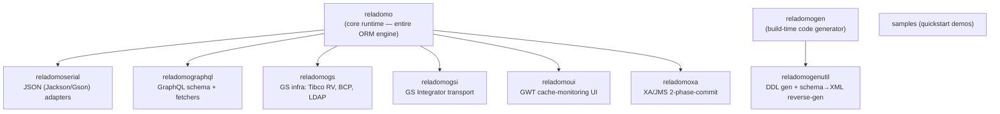
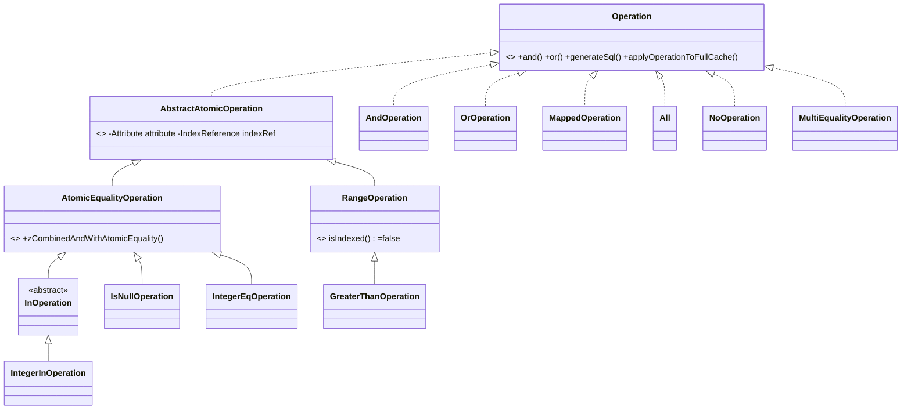
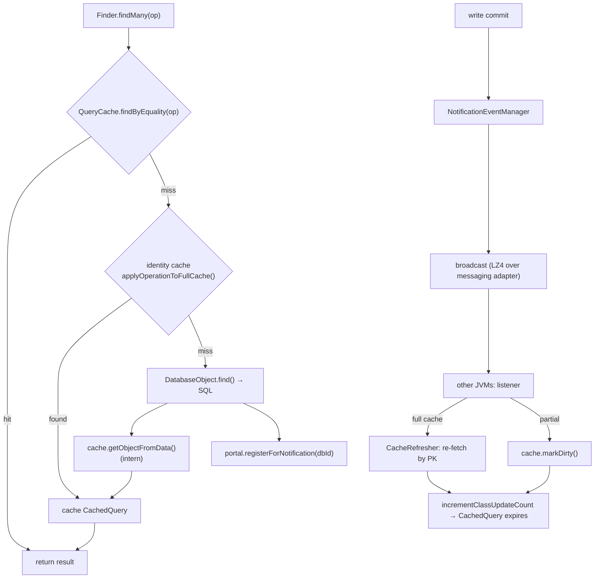
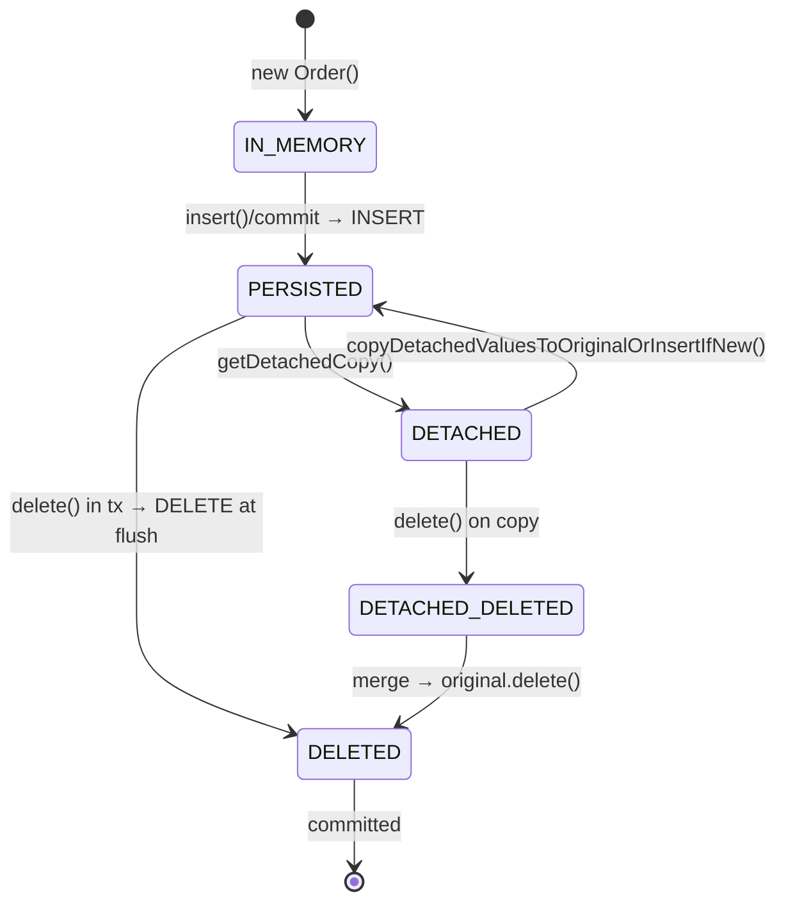

# Research: Reladomo Core Features

**Date**: 2026-06-26
**Git Commit**: `9b87d9e7cab32d4e9662b1d049a7d516e86f6bd4`
**Branch**: `master`
**Repository**: reladomo (`github.com/goldmansachs/reladomo`)

> **Subject of research.** This document describes the [Goldman Sachs Reladomo](https://github.com/goldmansachs/reladomo)
> Java O/R framework as checked out at `/Users/david/Code/reladomo` — **outside** the `parallax`
> working directory. All paths below are relative to that repo root. To keep citations readable, two
> long prefixes are abbreviated throughout:
>
> - **`mithra/`** = `reladomo/src/main/java/com/gs/fw/common/mithra/` (the hand-written runtime)
> - **`generator/`** = `reladomogen/src/main/java/com/gs/fw/common/mithra/generator/` (the code generator)
>
> GitHub permalinks follow the form
> `https://github.com/goldmansachs/reladomo/blob/9b87d9e7cab32d4e9662b1d049a7d516e86f6bd4/<path>#L<line>`.

## Research Question

The research-questions document (`01-research-questions-reladomo-core-features.md`) posed 13 descriptive questions — document how Reladomo works **today**, where each capability lives, and how the pieces interact:

1. Overall architecture & module layout; the role of `MithraManager`/`MithraManagerProvider` and `MithraObjectPortal` as coordination points.
2. Object metamodel & definition format (XML/XSD), object types, runtime configuration.
3. Code generation pipeline (XML → generated Java surface) and the generated/runtime boundary.
4. Bitemporal / milestoning support (`AsOfAttribute`, dated objects, milestone chaining).
5. Finder query language & operation model (`Operation` tree → SQL; `Mapper`/`MapperStack`).
6. Relationships & deep fetch (batching, N+1 elimination, reverse/dependent relationships).
7. List / set-based operations & aggregation (`MithraList`, `AggregateList`).
8. Identity cache & query cache (units of work, indices, invalidation/notification).
9. Transactions, optimistic locking & transactional correctness.
10. Detached objects & object lifecycle/behavior states.
11. Pluggable database support & the SQL dialect seam (incl. PostgreSQL specifics).
12. Test infrastructure & cross-database compatibility testing.
13. Footprint of the "excluded" features (source attributes/sharding, remote, XML, off-heap).

## Research Methodology (verbatim)

This document will remain objective and factual. It does not contain any recommendations or implementation suggestions.
Open questions will not ask Why things haven't been built or what should be built in the future.

There is no "implementation" section - that is intentional.

## Summary

Reladomo is a code-generation-driven, cache-centric, bitemporal O/R framework. A domain object is
defined once in an XML descriptor validated against `mithraobject.xsd`; the `reladomogen` build-time
tool parses it, builds an in-memory model, and runs a JSP-based template engine to emit a fixed set
of Java artifacts per object — an `Abstract` object, a `Data` carrier, a `Finder`, a `List`, and a
`DatabaseObject`. The generated code is **typed scaffolding**: it declares fields and getters/setters
and delegates every behavior to hand-written runtime base classes in `com.gs.fw.common.mithra`
(`generator/templates/transactional/Abstract.jsp:55-70` shows the generated abstract class extending
`mithra/superclassimpl/MithraTransactionalObjectImpl`). The "spine" of the runtime is two
coordinators: the process-wide singleton `MithraManager` (transactions, config loading, notification)
and one `MithraObjectPortal` per object type, which holds and routes between that type's identity
cache, query cache, finder/metadata, and database object.

Queries are expressed through a typed, composable `Operation` tree built from finder-attribute
predicates (`.eq()`, `.in()`, `.greaterThan()`); relationship traversals become `MappedOperation`
nodes wrapping a `Mapper` that encodes join columns. A read flows query cache → identity cache →
database (`mithra/portal/MithraAbstractObjectPortal.java:832`), and `SqlQuery` walks the operation
tree calling `generateSql()` to produce the WHERE clause and a list of parameter setters. Deep fetch
collapses N+1 navigation into one bulk `IN`-clause (or temp-table-join) query per relationship level
via a `DeepFetchNode` tree and per-relationship `DeepFetchStrategy` objects. Bitemporality is a
first-class, deeply-woven feature: `AsOfAttribute` models a `[from,to)` interval over a pair of
timestamp columns (business date `FROM_Z/THRU_Z` and processing date `IN_Z/OUT_Z`), `AsOfEqualityChecker`
injects defaulted as-of predicates into every query, and `TemporalDirector` implementations chain
milestone rows on write (close the old row by setting its out-date; insert a new row), including
bitemporal "rectangle splitting."

The cache layer is the heart of the system: each type has an identity cache (one in-memory object
per primary key, with Full/Partial × Dated/NonDated × OnHeap/OffHeap variants) and a query cache
(`Operation` → `CachedQuery` result list) invalidated through `UpdateCountHolder` version tokens and a
cross-JVM notification bus. Transactions are JTA-backed: writes are buffered as `TxOperations`,
combined/batched/ordered at commit, and flushed through the `MithraObjectPersister`. Correctness is
enforced automatically via pessimistic read locks (`SELECT … FOR UPDATE`-style, dialect-specific) or
optimistic locking (a `useForOptimisticLocking` version column checked in the UPDATE WHERE clause,
throwing a retriable `MithraOptimisticLockException`). Object lifecycle is a state machine
(`IN_MEMORY`, `PERSISTED`, `DELETED`, `DETACHED`, `DETACHED_DELETED`) dispatched through per-state
singleton behavior objects. Database portability is isolated behind the `DatabaseType` interface (10+
concrete dialects incl. `PostgresDatabaseType`), obtained from the connection manager at query time.

On the entanglement question: **remote/client-server** and **XML-config** are cleanly separable
(remote is a drop-in `MithraObjectReader` implementation behind the portal; runtime config is a plain
bean graph with a programmatic, non-XML entry point). **Off-heap** is a medium-coupled parallel cache
implementation with a few leaks into the common `MithraDataObject`/`Cache` contracts.
**Source attributes / sharding is highly coupled** — an `Object source` parameter threads through
~25 sites in the database layer and the `MithraCodeGeneratedDatabaseObject` interface, and source
metadata is exposed on the `RelatedFinder` and every `Attribute`.

## Detailed Findings

### 1. The runtime is a multi-module build whose spine is `MithraManager` (global) and `MithraObjectPortal` (per-type)

Reladomo is an Ant-based multi-module build (`build/build.xml`, `build/reladomolib.spec`); there is
no parent Maven/Gradle POM. Only `reladomo` is the runtime library — every other module depends on it
(except the two build-time tools, which depend on nothing at runtime):



Module responsibilities (from each module's build files and READMEs): `reladomogen` is the Ant-task
code generator (214 source files, JavaCC query parser, JSP templates); `reladomogenutil` adds DDL
generation and schema-to-XML reverse engineering; `reladomoserial`/`reladomographql` are serialization
and GraphQL layers; `reladomogs`/`reladomogsi`/`reladomoui`/`reladomoxa` are GS-internal infra
adapters; `samples` are standalone demos depending on the published `reladomo` jar.

The core package `mithra/` splits into the subsystems below, all coordinated by the portal:

| Package | Responsibility |
|---|---|
| `finder/` | The `Operation` predicate tree, `RelatedFinder`, `SqlQuery`, `Mapper`, deep-fetch strategies |
| `attribute/` | Typed attributes (`IntegerAttribute`, `TimestampAttribute`, `AsOfAttribute`); build operations, map to columns |
| `cache/` | Per-type identity cache (object store); Full/Partial/Dated/OffHeap variants + index structures |
| `querycache/` | Per-type query-result cache (`QueryCache`, `CachedQuery`) |
| `transaction/` | `MithraRootTransaction`/`MithraNestedTransaction`, buffered write operations (`TxOperations`) |
| `database/` | JDBC execution layer (`MithraAbstractDatabaseObject` = reader + persister) |
| `databasetype/` | Per-vendor SQL dialects behind `DatabaseType` |
| `portal/` | The per-type coordinator (`MithraObjectPortal`, `MithraAbstractObjectPortal`, transactional/read-only) |
| `behavior/` | Object lifecycle state machine; `TemporalDirector` for milestoning |
| `list/` | `MithraList` implementations + bulk/cascade command objects |
| `aggregate/` | `AggregateList`, group-by/having operations |
| `notification/` | Cross-JVM cache invalidation messaging |
| `remote/` | Three-tier (client-server) alternate implementation |
| `connectionmanager/` | JDBC connection pools; sourceless/int-source/object-source variants |
| `mithraruntime/` | XML unmarshalling of the runtime config into a bean graph |

**`MithraManager` is the process-wide singleton coordinator** (`mithra/MithraManager.java`).
It owns the thread-local current transaction (`threadTransaction`, line 66), the transaction retry
loop (`executeTransactionalCommand`, line 524; `startOrContinueTransaction`, line 246), runtime config
loading (delegated to `MithraConfigurationManager`, `readConfiguration` line 740), the notification
event manager (line 601), and the global `databaseRetrieveCount` (line 69). `MithraManagerProvider`
(`mithra/MithraManagerProvider.java:31`) is a thin static accessor that lets tests substitute the
instance.

**`MithraObjectPortal` is the per-type "brain"** (`mithra/MithraObjectPortal.java`,
`mithra/portal/MithraAbstractObjectPortal.java`, subclasses `MithraTransactionalPortal` and
`MithraReadOnlyPortal`). Each domain type has exactly one portal holding its `cache`, `queryCache`,
`finder`, and `mithraObjectReader`/persister (fields at `MithraAbstractObjectPortal.java:115-152`).
The portal constructor creates the `QueryCache` inline and calls `cache.setMithraObjectPortal(this)`
to wire the back-reference (lines 156-170).

The central read dispatch — `findAsCachedQuery()` — shows the spine in action:

```text
SomeFinder.findMany(op)
  AbstractRelatedFinder.findMany(op)
    MithraAbstractObjectPortal.findAsCachedQuery(op)          [portal/MithraAbstractObjectPortal.java:832]
      1. QueryCache.findByEquality(op)                         → hit? return CachedQuery
      2. AnalyzedOperation(op)                                 normalize + inject as-of predicates
      3. op.applyOperationToFullCache()/applyOperationToPartialCache()  → identity cache probe
      4. [miss] flushTransaction(op)                           push pending writes for consistency
         findFromServer(op) → getMithraObjectReader().find()  [= *DatabaseObject.find()]
           new SqlQuery(op); getConnection(); executeQuery()
           processResultSet() → cache.getObjectFromData()      intern objects into identity cache
         MithraManager.incrementDatabaseRetrieveCount()
```

Startup wiring: `MithraManager.readConfiguration()` → `MithraConfigurationManager.initializeRuntime()`
instantiates each `<className>DatabaseObject` (implements both `MithraObjectReader` and
`MithraObjectPersister`), the `<className>Finder` (implements `RelatedFinder`), and calls the
generated `instantiateFullCache`/`instantiatePartialCache` which constructs the `Cache` and the
`MithraObjectPortal` (`mithra/util/MithraConfigurationManager.java:817, 1469-1500`).

#### Testing patterns

Coordination/bootstrap is exercised through `MithraTestResource`
(`reladomo/src/test-util/java/com/gs/fw/common/mithra/test/MithraTestResource.java`), which parses a
runtime config, swaps in an in-process H2 connection manager via the
`MithraManager.zLazyInitObjectsWithCallback()` hook, and loads flat-file data. `MithraTestSuite`
(`reladomo/src/test/.../test/MithraTestSuite.java`) is the JUnit-3 aggregate run twice (partial vs
full cache). Remote-portal coordination is covered by `TestClientPortal`/`TestTransactionalClientPortal`.

### 2. A domain object is defined once in XML (`mithraobject.xsd`); runtime behavior is bound separately in a runtime-config XML

The object-definition schema is `reladomogen/src/main/xsd/mithraobject.xsd`. It defines five root
elements (lines 24-29): `<MithraObject>` (DB-backed), `<MithraPureObject>` (in-memory only),
`<MithraTempObject>` (session temp table), `<MithraInterface>`, and `<MithraEmbeddedValueObject>`.
The `objectType` attribute has exactly two legal values — `read-only` (default) and `transactional`
(lines 724-740). "Dated" is **not** a separate `objectType`; an object becomes dated when it declares
one or two `<AsOfAttribute>` children, which the generator detects via `hasAsOfAttributes()` and
prepends `"dated"` to the template category (`generator/MithraObjectTypeWrapper.java:645-650`).

What an object definition captures:

- **`<Attribute>`** (xsd 300-333): `name`, `javaType` (primitive/`String`/`Timestamp`/`Date`/`Time`/`BigDecimal`/`byte[]`), `columnName`, `primaryKey`, `nullable`, `maxLength`, `readonly`, `useForOptimisticLocking`, `identity`, `timezoneConversion`, `timestampPrecision`, and `primaryKeyGeneratorStrategy` (`Max` or `SimulatedSequence`).
- **`<SimulatedSequence>`** (xsd 862-906): `sequenceName`, `sequenceObjectFactoryName`, `batchSize`, `initialValue`, `incrementSize`, `hasSourceAttribute`.
- **`<AsOfAttribute>`** (xsd 278-298): `name`, `fromColumnName`, `toColumnName`, `infinityDate` (a Java code snippet in `[...]`), `infinityIsNull`, `toIsInclusive`, `isProcessingDate`, `defaultIfNotSpecified`, `timezoneConversion`.
- **`<Relationship>`** (xsd 541-627): the element body is a join-predicate expression (e.g. `this.accountNum = Account.accountNum`); attributes include `relatedObject`, `cardinality`, `reverseRelationshipName`, `relatedIsDependent`, `orderBy`, `parameters`, `foreignKey`.
- **`<Index>`** (xsd 673-689): comma-separated attribute names; `unique="true"` enables the cache fast path.
- **`<SourceAttribute>`** and inheritance (`superClassType` ∈ `table-per-subclass`/`table-for-all-subclasses`/`table-per-class`).

A real bitemporal example (`reladomo/src/test/reladomo-xml/TinyBalance.xml:28-34` and
`samples/reladomo-graphql-test-service/.../Balance.xml`):

```xml
<MithraObject objectType="transactional">
    <PackageName>...</PackageName><ClassName>Balance</ClassName><DefaultTable>BALANCE</DefaultTable>
    <AsOfAttribute name="businessDate"   fromColumnName="FROM_Z" toColumnName="THRU_Z" toIsInclusive="false"
                   infinityDate="[...DefaultInfinityTimestamp.getDefaultInfinity()]"/>
    <AsOfAttribute name="processingDate" fromColumnName="IN_Z"   toColumnName="OUT_Z"  isProcessingDate="true"
                   infinityDate="[...]" defaultIfNotSpecified="[...]"/>
    <Attribute name="id" javaType="int" columnName="BAL_ID" primaryKey="true"
               primaryKeyGeneratorStrategy="SimulatedSequence">...</Attribute>
    <Attribute name="accountNum" javaType="String" columnName="ACCT_NUM"/>
    <Attribute name="value"      javaType="double" columnName="VAL"/>
    <Relationship name="account" relatedObject="Account" cardinality="many-to-one">
        this.accountNum = Account.accountNum
    </Relationship>
</MithraObject>
```

**Runtime config is a separate XML** (`reladomo/src/main/xsd/mithraruntime.xsd`). `<MithraRuntime>`
contains `<ConnectionManager className="...">` blocks (each with `<Property>` and one or more
`<MithraObjectConfiguration>`), plus `<PureObjects>`, `<RemoteServer>`, and
`<MasterCacheReplicationServer>`. `<MithraObjectConfiguration>` (xsd 97-123) binds a fully-qualified
class name to a connection manager and declares `cacheType` (`partial`/`full`/`none`), `txParticipation`
(`full`/`readOnly`), `offHeapFullCache`, `cacheTimeToLive`, `loadCacheOnStartup`, etc. This separation
is deliberate: the same generated class is configured differently in prod vs. test.

```xml
<MithraRuntime>
  <ConnectionManager className="sample.util.H2ConnectionManager">
    <MithraObjectConfiguration cacheType="none"    className="sample.domain.ObjectSequence"/>
    <MithraObjectConfiguration cacheType="partial" className="sample.domain.Person"/>
  </ConnectionManager>
  <PureObjects notificationIdentifier="not">
    <MithraObjectConfiguration cacheType="full" className="sample.domain.PureBalance" offHeapFullCache="true"/>
  </PureObjects>
</MithraRuntime>
```

#### Testing patterns

The metamodel is validated end-to-end by `reladomogenutil`'s `GeneratorTestSuite`
(`reladomogenutil/src/test/.../generator/GeneratorTestSuite.java`): `MaxLenValidatorTest`,
`DatabaseTableValidatorTest` (boots H2, asserts the validator detects missing tables/columns/
`maxLength`), `DatabaseIndexValidatorTest`. The integration corpus uses ~407 pre-generated objects
from `reladomo/src/test/reladomo-xml/` whose generated sources live in `.../test/domain/`.

### 3. The code generator turns one XML into a fixed set of Java artifacts via a JSP template engine; generated code is scaffolding over the runtime

The generator is an Ant task (`generator/MithraGenerator.java`) delegating to `CoreMithraGenerator`.
The pipeline is **parse → validate → template**:

```text
generator/
├── MithraGenerator.java            # Ant task entry point
├── BaseMithraGenerator.java        # parse + validate orchestration
├── CoreMithraGenerator.java        # template dispatch + file writing
├── MithraXMLObjectTypeParser.java  # class-list + per-object XML parsing (parallel)
├── MithraObjectTypeWrapper.java    # rich in-memory model; drives template selection
├── metamodel/                      # FreyaXml-generated XML beans (MithraObjectType, AttributeType…)
├── queryparser/                    # JavaCC MithraQL parser for relationship predicates
│   └── ASTRelationalExpression.java  # validates types; emits constructEqualityMapper(...) calls
└── templates/                      # JSP templates by category
    ├── transactional/  (Abstract.jsp, Data.jsp, Finder.jsp, ListAbstract.jsp, DatabaseObjectAbstract.jsp, + concrete stubs)
    ├── readonly/  datedtransactional/  datedreadonly/  embeddedvalue/
```

1. **Parse** — `MithraXMLObjectTypeParser.parse()` (line 106) reads the class-list `<Mithra>` XML, then
   parallel-parses each referenced object file into a `MithraObjectTypeWrapper` (FreyaXml-generated
   `MithraGeneratorUnmarshaller`), tracking a CRC32 for change detection.
2. **Validate** — `BaseMithraGenerator.validateMithraObjectTypes()` (line 342): name checks, attribute
   resolution, superclass hierarchy sort, index validation, and `checkRelationships()` — which runs
   the JavaCC `MithraQL` parser on each predicate string to build `ASTRelationalExpression` trees and
   validate type compatibility.
3. **Template** — `CoreMithraGenerator.applyTemplates()` (line 224) selects a template list and package
   from static maps keyed by object type, then for each template instantiates the compiled `.jsp`
   (a class implementing `MithraTemplate`, `generator/MithraTemplate.java`) and calls
   `_jspService(request, response)` against a stub `HttpServletRequest` carrying the wrapper. The
   "servlet API" stubs (`generator/JspWriter.java`, `HttpServletRequest.java`) are a fiction enabling
   JSP syntax for codegen without a container.

The generated artifacts per (non-pure) object, and the scaffolding/runtime boundary:

| Artifact | Overwritten? | Inherits (runtime) | Role |
|---|---|---|---|
| `[Name]Abstract.java` | always | `MithraTransactionalObjectImpl` / read-only / dated variants | Typed getters/setters/relationships — **delegate to runtime state machine** |
| `[Name].java` | once | `[Name]Abstract` | Hand-written domain logic slot |
| `[Name]Data.java` | always | `MithraDataObject` | Plain data carrier for cache copy-on-write |
| `[Name]ListAbstract.java` | always | `AbstractTransactionalList` | Typed bulk ops + navigation |
| `[Name]List.java` | once | `[Name]ListAbstract` | Constructor stub |
| `[Name]Finder.java` | always | (static) | Holds the `MithraObjectPortal`, typed `Attribute` instances, indices |
| `[Name]DatabaseObjectAbstract.java` | always | `MithraDatabaseObject` subclass | Column binding, PK list, ResultSet inflation |
| `[Name]DatabaseObject.java` | once | `…Abstract` | Override slot |

Pure objects swap `DatabaseObject*` for `ObjectFactory*` (no SQL). The diagnostic for the boundary is
the `extends` clause in `templates/transactional/Abstract.jsp:55-70`: the generated abstract class is a
typed façade over `mithra/superclassimpl/MithraTransactionalObjectImpl`, where all persistence
behavior actually lives. "Once"-generated files survive regeneration (`replaceIfExists=false`),
routed to a source tree, while "always" files go to a build output dir.

#### Testing patterns

Generator correctness is primarily validated indirectly: the entire `reladomo` test suite depends on
the committed pre-generated `.../test/domain/` classes. Direct validator tests are in
`reladomogenutil/src/test/.../generator/` (see §2).

### 4. The finder query language builds a composable `Operation` tree that `SqlQuery` compiles to a WHERE clause

Every query node implements `Operation` (`mithra/finder/Operation.java:33-152`), which carries three
cache-resolution modes (`applyOperationToFullCache`, `applyOperationToPartialCache`, `applyOperation`
over a list), the `and`/`or` algebra, `generateSql()`, and introspection (`usesUniqueIndex`,
`getResultObjectPortal`, `zIsNone`). Leaf predicates come from typed finder attributes:
`OrderFinder.orderId().eq(42)` constructs an `IntegerEqOperation` (`finder/integer/IntegerEqOperation.java`).

The taxonomy:



Combination uses **double-dispatch**: `.and()` on an `AtomicEqualityOperation` calls
`op.zCombinedAndWithAtomicEquality(this)` (`finder/AtomicEqualityOperation.java:105-113`); two
equalities on the same class collapse into a `MultiEqualityOperation` (a multi-column index lookup) —
otherwise an `AndOperation` is built. `AndOperation.combineOperands()`
(`finder/AndOperation.java:527-583`) repeatedly pairwise-combines operands, separates `MappedOperation`s,
applies equality substitution into sub-queries, and sorts by `OperationEfficiencyComparator`
(most-selective first). `NoOperation` is the `and`/`or` identity; `All` means "no WHERE clause"; `None`
short-circuits to empty.

SQL generation: `SqlQuery` (`finder/SqlQuery.java`) wraps the op in an `AnalyzedOperation` (which
lazily runs the `AsOfEqualityChecker`, see §6), pre-registers all portals/joins via
`MithraDatabaseIdentifierExtractor`, then `prepareQuery()` calls `op.generateSql(this)` (line 222) to
recursively emit fragments. The `WhereClause` (`finder/WhereClause.java`) is a `StringBuilder` with
deferred AND/OR/bracket tokens resolved lazily, and accumulates `SqlParameterSetter` callables that
later bind `?` placeholders.

```text
// op = AndOperation[ IntegerGreaterThanOperation(orderId,100),
//                    MappedOperation(EqualityMapper(Order.orderId↔OrderItem.orderId),
//                                    IntegerEqOperation(OrderItem.productId,99)) ]
SqlQuery(op) → AnalyzedOperation → idExtractor.registerOperations()
prepareQuery() → op.generateSql(q)
  AndOperation: for each operand → q.beginAnd(); operand.generateSql(q); q.endAnd()
    IntegerGreaterThanOperation → "t0.ORDER_ID > ?"
    MappedOperation → mapper.generateSql(q)  // emits JOIN on ORDER_ID, assigns alias t1
                      op.generateSql(q)       // "t1.PRODUCT_ID = ?"
```

A **`Mapper`** models one join step between two portals (`finder/Mapper.java`); `EqualityMapper`
(single column) and `MultiEqualityMapper` (composite key) emit `t0.LEFT = t1.RIGHT`; `LinkedMapper`
chains multi-hop relationships. `MapperStackImpl` tracks the active mapper chain so attributes resolve
to the correct table alias.

#### Testing patterns

Query/operation behavior is covered by per-operator tests (`TestEq`, `TestIn`, `TestNotIn`, `TestLike`,
`TestGreaterThan`, …) and SQL-structure assertions via `Log4JRecordingAppender` (e.g. `TestExists.java:80-94`
counts `"left join"` occurrences in logged SQL). `MithraTestAbstract.genericRetrievalTest` cross-checks
ORM results against raw SQL row-by-row.

### 5. Deep fetch batches relationship traversal into one query per level, eliminating N+1

Relationships are `Mapper`-backed at runtime; navigating `order.getItems()` executes a query against
the child type constrained to the parent's FK values. Deep fetch is driven by a `DeepFetchNode` tree
mirroring the user's `deepFetch(Nav)` calls (`finder/DeepFetchNode.java`), where each node owns a
`DeepFetchStrategy` chosen by `AbstractRelatedFinder.zGetDeepFetchStrategy()`:

| Relationship | Strategy |
|---|---|
| simple to-one | `SimpleToOneDeepFetchStrategy` |
| simple to-many | `SimpleToManyDeepFetchStrategy` |
| complex/multi-hop | `ChainedDeepFetchStrategy` (decomposes the `LinkedMapper` into per-hop delegates) |

The key method is `SingleLinkDeepFetchStrategy.mapOpToList()` (`finder/SingleLinkDeepFetchStrategy.java:106-113`):
it builds one `MappedOperation` covering **all** parents and calls `findMany()` once. Results are
fanned back out to per-parent buckets by `associateResultsWithOps()` (lines 171-210), which calls
`mapper.getOperationFromResult(related)` per row, and each per-parent op is cached so later navigation
hits the query cache (`cacheResults()`, lines 142-168). For small parent lists (< `MAX_SIMPLIFIED_IN = 1000`),
a simplified `IN (...)` query is used; for larger/multi-attribute keys, a temp-table join
(`deepFetchWithTempContext`).

Worked example — `orders.deepFetch(items); orders.deepFetch(orderStatus)` over 1,000 orders:

```text
root query           : SELECT * FROM order WHERE <pred>                    (1)
items (to-many)      : SELECT * FROM order_item WHERE ORDER_ID IN (1..1000) (1)
orderStatus (to-one) : SELECT * FROM order_status WHERE ORDER_ID IN (1..1000)(1)
                       → 3 queries total, not 1 + 1000 + 1000 = 2001
```

Dependent (cascade) relationships are walked via `DeepRelationshipUtility.getDependentRelationshipFinders()`;
reverse relationships resolve in-memory in `MappedOperation.applyOperation()` by building a
`ConcurrentFullUniqueIndex` of right-hand objects and matching left→right
(`finder/MappedOperation.java:157-198`).

#### Testing patterns

`TestAdhocDeepFetch.java` is the primary suite; it asserts the exact DB-query count using the
before/after `getRetrievalCount()` pattern (e.g. `assertEquals(count+2, …)` for items+status) and
covers multi-attribute FK fetch and bitemporal temp-table paths. `TestDeepFetchExternalClose.java`
covers cursor/connection lifecycle.

### 6. Bitemporal milestoning: `AsOfAttribute` models `[from,to)` intervals; `TemporalDirector` chains milestone rows on every write

This is Reladomo's signature feature. An `AsOfAttribute` (`mithra/attribute/AsOfAttribute.java:59-665`)
is a query-time virtual attribute backed by a **pair** of timestamp columns — a `fromAttribute` and a
`toAttribute`. A row is "current" when its `to` equals the **infinity** sentinel (e.g.
`9999-12-01 23:59:00.0`). Two as-of dimensions are typical: business date (`FROM_Z/THRU_Z` — when the
fact is true in the world) and processing date (`IN_Z/OUT_Z`, `isProcessingDate="true"` — when the
system knew it).

The interval is `[from, to)` when `toIsInclusive=false` (the default). The SQL predicate
(`finder/asofop/AsOfEqOperation.java:215-252`):

```text
asOfDate == infinity              →  toColumn = ?                       (1 bind, matches current rows)
asOfDate <  infinity, exclusive   →  fromColumn <= ?  AND toColumn > ?  (2 binds)
asOfDate <  infinity, inclusive   →  fromColumn <  ?  AND toColumn >= ? (2 binds)
```

**Edge-point** queries (`equalsEdgePoint()`, lines 189-197) select rows by the stored boundary itself
rather than containment — used to fetch full history.

**Defaulting**: `AsOfEqualityChecker` (`mithra/finder/AsOfEqualityChecker.java`) walks the operation
tree, finds all as-of attributes, and `lookForMissingDefaults()` (lines 158-179) synthesizes an
`AsOfEqOperation` from `getDefaultDate()` for any dimension the caller omitted — so leaving out
`processingDate` automatically adds `processingDate = infinity` ("as of now").

Dated objects carry extra runtime state: a `DatedTransactionalState`
(`mithra/DatedTransactionalState.java:27-335`) with a `TemporalContainer` that holds all in-transaction
date segments for a primary key, enabling multi-slice chaining. The mutation contract on
`MithraDatedTransactionalObject` adds `insertUntil`, `insertWithIncrement`, `terminate`,
`terminateUntil`, `purge`, `inactivateForArchiving`.

**Write-time chaining** is performed by a `TemporalDirector` (`mithra/behavior/TemporalDirector.java`),
with three implementations: `GenericBiTemporalDirector` (both axes), `AuditOnlyTemporalDirector`
(processing only), `GenericNonAuditedTemporalDirector` (business only). The core is
`GenericBiTemporalDirector` (`mithra/behavior/GenericBiTemporalDirector.java`):

- **Insert** (71-103): set `IN_Z=txTime`, `OUT_Z=∞`, `THRU_Z=∞`; insert one row.
- **`inactivateObject`** (301-345): close an existing row — `UPDATE … SET OUT_Z=txTime WHERE PK AND FROM_Z=? AND THRU_Z=? AND IN_Z=? AND OUT_Z=∞`.
- **Update** (405-503): close the old row and insert a new head row `[fromDate, ∞)` at `IN_Z=txTime`; `cutTail` shortens the preceding segment's `THRU_Z` to `fromDate`.
- **`updateUntil`** (1011-1127) + **`splitTailEnd`** (1129-1137): the bitemporal **rectangle split** — one row becomes head `[from, fromDate)`, middle `[fromDate, endDate)`, tail `[endDate, to)`, all at fresh processing time, with the original inactivated.
- **Terminate** (687-756): close all open rows (`OUT_Z=txTime`); no new insert. Terminated state = absence of any row with `OUT_Z=∞ AND THRU_Z=∞`.

```text
BEFORE:  business [FROM_Z ─────────────── THRU_Z=∞)   proc [IN_Z ───────────── OUT_Z=∞)
UPDATE at businessDate=BD:
  old row closed   :  business [FROM_Z ─────────── ∞)   proc [old_IN_Z ── OUT_Z=txNow)
  new head row     :  business [BD ──────────────── ∞)   proc [txNow ──────── OUT_Z=∞)
  new left residual:  business [FROM_Z ─── BD)           proc [txNow ──────── OUT_Z=∞)
```

#### Testing patterns

`TestDatedBitemporal.java` (5600+ lines, 100+ methods) is the canonical suite, with SQL-level
assertions via `TestDatedBitemporalDatabaseChecker` (`checkDatedBitemporalInfinityRow`,
`checkDatedBitemporalTerminated`, etc.). Companions: `TestDatedAuditOnly`, `TestDatedNonAudited`,
`TestDatedBitemporalOptimisticLocking`, `TestDatedDetached`, `FullDatedTransactionalCacheTest`.

### 7. Lists are lazy operation-backed views; `AggregateList` runs GROUP BY/HAVING (in SQL or in-memory)

Every generated typed list (e.g. `OrderList`) extends `DelegatingList`
(`mithra/list/DelegatingList.java:86`), forwarding all `List` methods to a swappable
`MithraDelegatedList`. Two delegate forms exist: **operation-based (lazy)**
(`AbstractOperationBasedList`) and **non-operation-based (adhoc, mutable)**
(`AbstractNonOperationBasedList`). A lazy list resolves on first access via `resolveOperation()`
(`mithra/list/AbstractOperationBasedList.java:204-233`), which calls
`portal.findAsCachedQuery(op)`; `forceResolve()` triggers it explicitly, `forEachWithCursor()` streams
from the DB, and `asAdhoc()` copies the resolved items into a mutable list.

Set-oriented operations (transactional lists, `AbstractTransactionalOperationBasedList`):

| Operation | Mechanism |
|---|---|
| Bulk `setAttribute` | resolve list, call `attr.setXValue(item, v)` per item (multi-update buffered in tx) |
| `deleteAll` | `DeleteAllTransactionalCommand` → `tx.deleteUsingOperation(op)` (single `DELETE … WHERE`) |
| `deleteAllInBatches` | retry-loop command; halves batch size on rollback |
| `insertAll` / `bulkInsertAll` | `InsertAllTransactionalCommand` (+ bulk-insert threshold) |
| `cascadeInsertAll` / `…DeleteAll` / `…TerminateAll` | walk dependent relationships |
| `terminateAll` / `purgeAll` | dated equivalents of delete |

**Aggregation** uses a separate `AggregateList` (`mithra/AggregateList.java:38`, not a `MithraList`).
The user registers named aggregate attributes, group-bys, and an optional having operation:

```java
AggregateList list = new AggregateList(BalanceFinder.businessDate().eq(date));
list.addGroupBy("account", BalanceFinder.accountNum());
list.addAggregateAttribute("sumValue", BalanceFinder.value().sum());
list.setHavingOperation(BalanceFinder.value().sum().greaterThan(100.0));
```

It resolves lazily through `portal.findAggregatedData(...)`. There are two paths: an **in-memory**
aggregation (`MithraAbstractObjectPortal.aggregateInMemory()`, line 1121) used when the underlying
objects are already cached and all group-bys are to-one; otherwise a **SQL** path
(`MithraAbstractDatabaseObject.findAggregatedData()`, line 2313) building an `AggregateSqlQuery`. The
SQL produced for the example:

```sql
SELECT t0.account_num, sum(t0.value)
FROM balance t0
WHERE t0.business_date_from <= ? AND t0.business_date_to > ?
GROUP BY t0.account_num
HAVING sum(t0.value) > ?
```

Each row is an `AggregateData` (`Object[] values` indexed by an `AggregateDataConfig`). Supported
functions (via per-type calculators in `mithra/attribute/calculator/aggregateFunction/`): `sum`,
`avg`/`mean`, `count`, `min`/`max` (numeric, string, date, timestamp, time, boolean, char),
`standardDeviationSample`/`Population`, `varianceSample`/`Population` (the stddev/variance functions
read two result columns). HAVING comparators: `eq`, `notEq`, `greaterThan(Equals)`, `lessThan(Equals)`,
composable with AND/OR.

#### Testing patterns

`aggregate/AggregateTestSuite.java` aggregates `TestAggregateList`, `TestAggregationWithHavingClause`,
`TestAggregateListWithOrderBy`, `TestAggregateWithNull`, `TestDatedAggregation`, and `AggregateBeanList`
variants. List/bulk operations: `TestTransactionalList`, `TestTransactionalAdhocFastList`,
`TestDetachedListUsesCache`.

### 8. The identity cache guarantees one object per PK; the query cache maps operations to results; notification invalidates both

Each type has two caches behind the portal. The **identity cache** (`mithra/cache/Cache.java`) interns
objects so there is exactly one in-memory instance per primary key: database rows are funneled through
`getObjectFromData()`/`getManyObjectsFromData()` (`mithra/cache/AbstractNonDatedCache.java:1023-1155`),
which look up the primary-key index under a read lock and create via `factory.createObject(data)` only
on miss (double-checked under write lock). The implementation matrix:

| Cache | Dated | Full/Partial | Heap | Primary index | Eviction |
|---|---|---|---|---|---|
| `FullNonDatedCache` | no | full | on | `FullUniqueIndex` (strong) | none |
| `PartialNonDatedCache` | no | partial | on | `PartialPrimaryKeyIndex` (soft/weak) | GC + TTL |
| `FullDatedCache` | yes | full | on | `FullSemiUniqueDatedIndex` | none |
| `PartialDatedCache` | yes | partial | on | `PartialSemiUniqueDatedIndex` | GC + TTL |
| `OffHeapFullDatedCache` | yes | full | off | `OffHeapSemiUniqueDatedIndex` | manual off-heap |

The dated caches use a **semi-unique** index (`SemiUniqueDatedIndex`): the non-dated business key is
non-unique (many effective dates), but the full key (business key + as-of dates) is unique;
`FullSemiUniqueDatedIndex` keeps two hash tables (non-dated + dated). Secondary non-unique indices are
wrapped in `LazyIndex` (populated on first use). Partial caches use soft/weak references with a
background `MithraReferenceThread` and a `CacheClock` TTL.

The **query cache** (`mithra/querycache/QueryCache.java`) maps an `Operation` to a `CachedQuery`
holding the live result list of already-interned objects. Freshness is via `UpdateCountHolder` version
tokens: a `CachedQuery` records the update-counts of all portals/attributes it depends on, and
`isExpired()` (`mithra/querycache/CachedQuery.java:259-266`) returns true if any changed — so any write
that bumps a class/attribute update-count invalidates all dependent cached queries without enumerating
them. Full caches use a lock-free `NonLruQueryIndex`; partial/timed caches use an LRU `LruQueryIndex`.

The full read flow and invalidation bus:



Notification (`mithra/notification/`): on commit, `MithraLocalTransaction` broadcasts buffered
`MithraNotificationEvent`s (serialized + LZ4) on a per-database subject; receiving JVMs dispatch to a
`MithraNotificationListener`. Full-cache listeners re-fetch changed rows from the DB
(`CacheRefresher`); partial-cache listeners just `markDirty` and bump update counts.

#### Testing patterns

`TestCache.java` (full/partial × dated/non-dated, TTL via `CacheClock.forceTick()`), `TestPartialCache.java`
(direct `LruQueryIndex`/`PartialPrimaryKeyIndex`/`ReadWriteLock` unit tests),
`notification/InMemoryMessagingAdapterFactory` (in-process notification), and
`multivm/MultiVmNotificationsTestSuite` (forked-JVM notification).

### 9. Transactions are JTA-backed with buffered/batched writes; correctness comes from read locks or optimistic version checks

A transaction is `MithraRootTransaction` (extends `MithraLocalTransaction`, implements JTA
`Synchronization`) or a delegating `MithraNestedTransaction`. `MithraManager.executeTransactionalCommand()`
(`mithra/MithraManager.java:524-566`) runs a retry loop: `startOrContinueTransaction()` (begins a JTA
tx + creates the root + installs a per-tx query cache), `command.executeTransaction(tx)`, then
`tx.commit()`; on a retriable `MithraBusinessException` it rolls back and retries (default 10 retries).

The JTA `TransactionManager` is supplied through a one-method `JtaProvider` interface
(`mithra/JtaProvider.java:23-26`). By default `MithraManager` uses its own in-process implementation —
`private JtaProvider jtaProvider = new DefaultJtaProvider(new LocalTm())` (`MithraManager.java:65`),
where `LocalTm` (`mithra/transaction/LocalTm.java`) is a bundled `TransactionManager` and
`DefaultJtaProvider` (`mithra/DefaultJtaProvider.java:22-36`) is a thin holder that returns whatever
manager it was constructed with (no JNDI/auto-discovery). Production code installs a
container-managed or embedded manager via the single setter
`MithraManager.setJtaTransactionManagerProvider(JtaProvider)` (`MithraManager.java:223-226`, documented
as "must be called as part of initialization"). The actual `begin()` happens in
`startOrContinueTransaction`: `getJtaTransactionManager().begin()` (`MithraManager.java:262`), then
`getTransaction()` (264) is wrapped by `createMithraRootTransaction(jtaTx, …)` (404-410), which installs
the per-tx query cache and calls `jtaTx.registerSynchronization(result)`.

Writes are **buffered** as `TxOperations` (`mithra/transaction/TxOperations.java`): `addUpdate` merges
into an existing `UpdateOperation`/`InsertOperation` for the same object; `addInsert` upgrades to
`BatchInsertOperation`; `addDelete` cancels a matching insert. At commit, `executeBufferedOperations()`
runs `combineAll()` (combine/reorder with up to 10-op lookahead to respect FK ordering) then
`op.execute()` per operation, each calling the persister (`MithraAbstractDatabaseObject.zInsert/zUpdate/zBatchUpdate/zDelete`).

```text
executeTransactionalCommand(command)
  startOrContinueTransaction → jtaTx.begin(); new MithraRootTransaction; install per-tx QueryCache
  command.executeTransaction(tx)        # order.setStatus(...) → buffer UpdateOperation
  tx.commit()
    executeBufferedOperations()
      dependentOperations.combineAll()  # merge + order for FK constraints
      for each op: op.execute() → persister.update() → PreparedStatement.executeUpdate()
    jtaTx.commit()
      afterCompletion() → cache.commit(tx); incrementClassUpdateCount; broadcastNotification
```

**Correctness without user intervention.** The default `FullTransactionalParticipationMode` makes
reads inside a transaction acquire a row lock: enrolling a persisted object for read calls
`zRefreshWithLockForRead` → `portal.refresh(data, lockInDatabase=true)`, whose SQL appends a
dialect-specific lock suffix (Oracle `FOR UPDATE OF col`, Sybase `WITH HOLDLOCK`, DB2
`WITH RR USE AND KEEP SHARE LOCKS`). Per-object in-transaction state lives in `TransactionalState`
(`txData != null` ⇒ write-enrolled; null ⇒ read-locked) with an atomically-updated owning-transaction
reference. Deadlocks are detected by a wait-chain check (`waitForTransactionToFinish`), throwing a
retriable `MithraTransactionException`.

**Optimistic locking.** An attribute marked `useForOptimisticLocking="true"` becomes a version column.
In `ReadCacheWithOptimisticLockingTxParticipationMode`, reads do **not** lock; instead the generated
UPDATE appends `AND <version> = ?` (the shadow value read earlier). After `executeUpdate`,
`checkUpdatedRows` (`mithra/database/MithraAbstractDatabaseObject.java:3725-3746`) sees `updatedRows != 1`,
calls `cache.markDirtyForReload`, and throws `MithraOptimisticLockException` (marked retriable when
`tx.retryOnOptimisticLockFailure()`), which the outer retry loop catches — the next attempt re-reads
the fresh version.

```sql
update OPTIMISTIC_ORDER set STATE = ? where ORDER_ID = ? AND VERSION = ?
-- if 0 rows updated → MithraOptimisticLockException (retriable) → retry with refreshed version
```

#### Testing patterns

`TestOptimisticTransactionParticipation.java` runs two-thread races (thread 2 mutates the version via
raw JDBC mid-flight) asserting the exception + retry resolves correctly; `TestDatedBitemporalOptimisticLocking`,
`TestDetachedOptimisticAuditOnly` cover dated/detached variants. `OptimisticOrder.xml` is the fixture.

### 10. Object lifecycle is a state machine dispatched through per-state singleton behavior objects; detach copies data and merges it back

Each transactional object holds a `persistenceState` int and a nullable `TransactionalState`. The
states (`mithra/behavior/state/PersistenceState.java:40-47`): `IN_MEMORY` (new, uninserted),
`PERSISTED`, `DELETED`, `DETACHED`, `DETACHED_DELETED`, plus non-transactional variants. A static
`allStates[]` table maps each state to a `PersistenceState` object that returns one of five singleton
`TransactionalBehavior` instances depending on the relationship between the calling thread's
transaction and the object's enrolled transaction (`getForNoTransaction`, `getForSameTransaction`,
`getForEnrollTransaction`, `getForDifferentTransaction`, `getForThreadNoObjectYesTransaction`). Every
get/set/insert/delete dispatches through
`zGetTransactionalBehaviorFor{Read,Write}WithWaitIfNecessary()`, which routes via the current
`MithraManager.zGetTransactionalBehaviorChooser()`.



**Detaching** (`PersistedBehavior.getDetachedCopy`, `mithra/behavior/persisted/PersistedBehavior.java:73-82`)
deep-copies the data object into a brand-new instance with `persistenceState=DETACHED` and a null
`transactionalState` — fully decoupled from the cache (the original keeps living in the cache). Modifying
a detached object writes only to its in-memory copy (no SQL). **Merging back**
(`copyDetachedValuesToOriginalOrInsertIfNew`, `mithra/superclassimpl/MithraTransactionalObjectImpl.java:1563-1589`)
starts a transaction, calls `zFindOriginal()` (cache lookup by PK), and if found copies attributes onto
the live object (triggering normal buffered UPDATEs) or inserts if new. `isModifiedSinceDetachment()`
compares the copy to the original field-by-field.

#### Testing patterns

`TestDetached.java` (detached insert/update), `TestDatedDetached.java`, `TestTransactionalObject.java`
(multi-thread detached/delete interactions). Behavior-state dispatch is exercised implicitly by the
whole transactional test corpus.

### 11. Database portability is isolated behind `DatabaseType`, obtained from the connection manager at query time

All SQL-dialect variation lives behind `DatabaseType` (`mithra/databasetype/DatabaseType.java`, extends
`CommonDatabaseType` which declares the 14 `getSqlDataTypeFor*` mappings). Each dialect is a singleton
extending `AbstractDatabaseType` (which provides defaults and recursive SQLException-chain walkers).
Concrete dialects: `PostgresDatabaseType`, `H2DatabaseType`, `OracleDatabaseType`, `SybaseDatabaseType`,
`SybaseIqDatabaseType`, `SybaseIqNativeDatabaseType`, `MsSqlDatabaseType`, `MariaDatabaseType`,
`Udb82DatabaseType` (DB2), `SnowflakeDatabaseType`, `DerbyDatabaseType`, and a stub `GenericDatabaseType`.

The seam: connection managers return the `DatabaseType` (`SourcelessConnectionManager.getDatabaseType()`,
`ObjectSourceConnectionManager.getDatabaseType(Object)`). `MithraAbstractDatabaseObject` obtains it via
the generated `getDatabaseTypeGenericSource(source)` and calls it at every SQL decision point —
`getSelect` (line 1653), `limitRowCount` (477), temp-table DDL (619), `refresh` lock suffix (2229),
aggregate SELECT (2349), multi/batch/bulk insert (4636+), error classification (1831), timestamp
bind/read (in generated inflation). Nothing uses a registry; the dialect always comes from the
connection manager.

What varies (capability matrix, abbreviated):

| Concern | Postgres | H2 | Oracle | Sybase ASE | MsSql | DB2 (Udb82) | Snowflake |
|---|---|---|---|---|---|---|---|
| Row limit | `LIMIT n+1` | `ROWNUM()<=n` | `ROWNUM<=n` | `TOP n+1` | `TOP n+1` | `FETCH FIRST n+1 ROWS` | `LIMIT n+1` |
| `SET ROWCOUNT` | no | no | no | yes | yes | no | no |
| Read lock | `FOR SHARE OF t0` | (none) | `FOR UPDATE OF col` | `holdlock` per-table | `WITH(serializable)` | `WITH RR…` | none |
| Temp table | `CREATE TEMPORARY … ON COMMIT DROP/PRESERVE` | `CREATE GLOBAL TEMPORARY` | `CREATE GLOBAL TEMPORARY … ON COMMIT DELETE/PRESERVE` | `CREATE TABLE #name` | `#name` | `DECLARE GLOBAL TEMPORARY SESSION.name` | `CREATE TEMPORARY` |
| Bulk load | none | none | none | BCP (`JtdsBcpBulkLoader`) | none | none | none |
| Multi-insert | none | optional VALUES | none | `UNION ALL SELECT` | `VALUES(...)` | `VALUES(...)` | none |
| Deadlock code | states 40P01/40001 | 40001 | 40001 | 1205 | 1205/1211 | -911 / 57033 | never |
| Unique-violation | state 23505 | 23505/23001 | 23001 | 2601 | 2601 | -803 | 23505 |
| Max IN clauses | 240 | 240 | 240 | 420 | 2000 | 1000 | 240 |

`MariaDatabaseType` (not shown in the matrix) uses `LIMIT n+1` for row-limit and `LOCK IN SHARE MODE`
for read locking; it disables multi-insert — both `hasSelectUnionMultiInsert()` and `hasValuesMultiInsert()`
return `false` (`MariaDatabaseType.java:341-349`), so inserts fall back to standard single-row JDBC
batching (`getMaxPreparedStatementBatchCount()` = 100).

**PostgreSQL specifics** (`mithra/databasetype/PostgresDatabaseType.java`): types `boolean`, `bytea`,
`float8/float4`, `int2/int8`, unbounded `varchar`, `numeric` (lines 225-295); pagination via
`LIMIT n+1` appended in `getSelect` (line 111) with `hasTopQuery()=true`; row lock `FOR SHARE OF t0`
(no `FOR UPDATE`); capped DELETE via a `ctid = any(array(select ctid … limit n))` trick (line 139);
temp tables `ON COMMIT DROP` in-tx else `PRESERVE ROWS`, auto-dropped (`nonSharedTempTablesAreDroppedAutomatically=true`);
`UPDATE … FROM tempTable t1 WHERE …` join syntax (no `t0.` prefix in SET); error codes 40P01/40001
(deadlock) and 23505 (unique); **no bulk loader** (`hasBulkInsert()=false`); `EXTRACT(... )` and
`AT TIME ZONE` for date/timezone extraction; a settable `tempSchema`.

#### Testing patterns

Dialect logic is mostly exercised through H2 (the default in-memory DB). Unit tests: `SybaseDatabaseTypeTest`
(connection-dead/deadlock classification), `H2DatabaseTypeForTests` (test subclass that can suppress
temp-table DDL). Real-DB integration scaffolding: `MithraPostgresTestAbstract` + `PostgresTestConnectionManager`
(see §12).

### 12. The test suite is an H2-based, no-mock integration harness; the same tests re-run on real vendors via swapped connection managers

The ~1,700-file test tree:

```text
reladomo/src/test/
├── java/.../test/
│   ├── MithraTestSuite.java            # master H2 suite (~70 classes)
│   ├── MithraTestAbstract.java         # base for H2 tests
│   ├── Mithra<DB>TestAbstract.java     # Postgres/Oracle/Sybase/Db2/Maria/MsSql/Snowflake/SybaseIq bases
│   ├── Mithra<DB>TestSuite.java        # per-vendor suite → Test<DB>GeneralTestCases
│   ├── <DB>TestConnectionManager.java  # per-vendor CM
│   └── aggregate/ attribute/ cacheloader/ domain/(828 gen files) offheap/ multivm/ pure/ …
├── reladomo-xml/                       # 407 object definitions
└── resources/
    ├── MithraConfig{Partial,Full,OffHeapFull}Cache.xml   # H2 runtime configs
    ├── Mithra<DB>TestConfig.xml                          # per-vendor configs
    ├── credentials.properties                            # all real-DB creds = "unpublished"
    └── testdata/*.txt                                    # flat-file fixtures
reladomo/src/test-util/.../test/
    ├── MithraTestResource.java          # the harness
    ├── ConnectionManagerForTests.java   # H2/Derby in-memory CM
    └── MithraTestDataParser.java        # flat-file parser
```

**No-mock harness** (`MithraTestResource`): on `setUp()` it starts H2 (just
`Class.forName("org.h2.Driver")`), parses the runtime config
(`MithraManager.parseConfiguration`), wires connection managers to generated database objects, creates
tables (`verifyTable` → `dropTestTable` → `createTestTable`), and inserts flat-file data parsed by a
`StreamTokenizer` state machine (`class <FQN>` header, comma-separated attribute row, then data rows).
`tearDown()` rolls back, deletes all rows, and resets. Each logical "source" gets its own
`jdbc:h2:mem:<schema>` database.

**Cross-database** testing reuses the *same* behavioral test logic: each `Test<DB>GeneralTestCases`
extends `Mithra<DB>TestAbstract` (which constructs `MithraTestResource` with the vendor's `DatabaseType`
and connection manager) and **delegates** to the shared H2 test instances as plain method calls
(e.g. `new CommonVendorTestCases().testRollback()`). Verification uses `validateMithraResult(op, sql, minSize)`:
run the ORM query with `setBypassCache(true)` and the caller-supplied raw SQL, then compare row-by-row
via a `ResultSetComparator`.

Two precise behavioral assertion patterns recur:

- **Retrieval-count**: `getRetrievalCount()` (= `MithraManager.getDatabaseRetrieveCount()`) before/after
  an operation asserts the exact number of DB round-trips (cache hit ⇒ unchanged; deep fetch ⇒ +N).
- **Expected-SQL**: `Log4JRecordingAppender` captures the generated SQL string and tests assert its
  structure (e.g. count of `"left join"`).

**Agnostic vs dialect-specific split.** The default build runs `MithraTestSuite` on H2 (partial + full,
and a third off-heap pass) — the vast majority of behavior. The 8 vendor suites live in a separate Ant
target (`mithra-vendor-test-suite`) not chained by any CI target, and are *implicitly gated* because all
`credentials.properties` entries are `"unpublished"`, so the vendor connection pools simply fail to
initialize. Vendor suites cover CRUD, large-IN chunking, batch/bulk DML, BigDecimal/timestamp precision,
rollback — plus genuinely dialect-specific tests with no H2 equivalent (e.g. Sybase BCP).

#### Testing patterns

This section *is* the testing-patterns documentation; the harness itself is the unit under study.

### 13. Entanglement check: remote and XML are cleanly separable; off-heap is medium-coupled; source-attribute/sharding is highly coupled

The four features the ticket proposes to exclude differ sharply in how deeply they are woven in.

**(a) Source attributes / sharding — HIGH coupling.** An `Object source` parameter threads through the
entire database layer. The generated `MithraCodeGeneratedDatabaseObject` interface declares 12
`*GenericSource` methods (`mithra/database/MithraCodeGeneratedDatabaseObject.java:40-58`), emitted by
`generator/templates/CommonDatabaseObjectAbstract.jspi:64-185` even for sourceless objects (returning
null). `MithraAbstractDatabaseObject` derives `source` and passes it into `getDatabaseTypeGenericSource`/
`getConnectionGenericSource`/`getSchemaGenericSource` at ~25 read/write/helper sites. `SqlQuery` tracks
a `SourceOperation` per query (`getNumberOfSources()` drives a per-source execution loop); every
`AtomicEqualityOperation` implements `SourceOperation`. `RelatedFinder` exposes `getSourceAttribute()`/
`getSourceAttributeType()`, every `Attribute` has `isSourceAttribute()`, the connection-manager
contract is split three ways (`Sourceless`/`IntSource`/`ObjectSource`), and `CacheRefresher`/`cacheloader`/
transaction ops segregate by source. There is no seam to compile source-awareness out.

**(b) Client-server / remote mode — LOW–MEDIUM coupling.** `remote/` (54 files) is a drop-in alternate
implementation of `MithraObjectReader`/`MithraDatedObjectPersister` (`remote/RemoteMithraObjectPersister.java`).
The portal holds a single `mithraObjectReader` field and dispatches uniformly — **no `instanceof Remote`
branching anywhere in the portal**. The only fork is at config-init time in the generated
`Finder.initializeClientPortal` (chosen when `config.isThreeTierClient()`). The residual coupling:
`MithraConfigurationManager` imports `RemoteMithraService`/`RemoteMithraObjectConfig` and `MithraManager`
imports `MithraRemoteTransactionProxy`, so config/transaction code has compile-time references to the
remote package even in local-only deployments.

**(c) XML configuration — LOW coupling.** Two XML layers: object-definition XML is **compile-time only**
(consumed by `reladomogen`; the generated runtime contains no XML logic), and runtime-config XML is
**load-time only**. The runtime parse is a thin skin: `MithraRuntimeUnmarshaller` (FreyaXml-generated)
is called once in `MithraConfigurationManager.parseConfiguration()` producing a plain `MithraRuntimeType`
bean graph, and `initializeRuntime(MithraRuntimeType)` is a **public, XML-free entry point**. Tests prove
a fully programmatic path (`test/overlap/AbstractOverlapFixerTest.java:72-81` builds `MithraRuntimeType`/
`ConnectionManagerType` in pure Java; `MithraTestResource` accepts a pre-built `MithraRuntimeType`). After
load, no portal/finder/attribute holds XML types.

**(d) Off-heap storage — MEDIUM coupling.** Off-heap caches (`OffHeapFullDatedCache`,
`OffHeapFullDatedTransactionalCache`, `NonUniqueOffHeapIndex`, `OffHeapSemiUniqueDatedIndex`) are
parallel subclasses behind `AbstractDatedCache` and the `Cache`/`Index`/`SemiUniqueDatedIndex`
interfaces (only dated objects can be off-heap). But there are three leaks into the common contract:
`MithraDataObject.zCopyOffHeap()` is on the root interface (importing `MithraOffHeapDataObject`) and
every generated data class implements it (throwing when off-heap is off); `AbstractDatedCache`'s
constructor and two abstract factory methods carry `OffHeapDataStorage` in their signatures even for
on-heap subclasses (which pass/ignore null); and `Cache.isOffHeap()` + four size methods are on the
interface. The on-heap cache body itself has only two `isOffHeap()` hash-dispatch branches.

| Feature | Isolation mechanism | Coupling | Key entanglement points |
|---|---|---|---|
| Source attributes / sharding | `Object source` generic routing; 3-way connection-manager split | **HIGH** | 12 `*GenericSource` methods; ~25 DB-layer sites; `SourceOperation` in `SqlQuery`; `getSourceAttribute()` on `RelatedFinder`; `isSourceAttribute()` on every `Attribute` |
| Client-server / remote | `MithraObjectReader`/persister interface; portal dispatches uniformly | **LOW–MEDIUM** | `MithraConfigurationManager`/`MithraManager` compile-time imports; generated `initializeClientPortal` fork |
| XML configuration | `MithraRuntimeType` bean graph; `initializeRuntime(MithraRuntimeType)` public entry | **LOW** | XML parse isolated to `parseConfiguration`; programmatic path proven by tests |
| Off-heap storage | parallel cache/index subclasses behind `Cache`/`AbstractDatedCache` | **MEDIUM** | `MithraDataObject.zCopyOffHeap()` on root interface; `OffHeapDataStorage` in `AbstractDatedCache` signatures; `Cache.isOffHeap()` |

#### Testing patterns

Source/sharding: tests using `*StringSource*`/`*IntSource*` data files and source-attributed XML
(`DatedAccount.xml`). Remote: `multivm/` suites + `TestClientPortal`. Off-heap: `offheap/` package run
via `MithraConfigOffHeapFullCache.xml` as a third `MithraTestSuite` pass. Programmatic config:
`AbstractOverlapFixerTest`.

### 14. A runtime metamodel-introspection seam (`RelatedFinder` + `ReladomoClassMetaData`) lets non-core modules map the model without XML

The serialization (`reladomoserial`) and GraphQL (`reladomographql`) modules build JSON serializers and
GraphQL schemas at runtime purely by introspecting the **generated** metamodel — no XML is read at the
point of use. Both depend on the same two-level seam, which is itself a core capability worth noting for
any extraction:

- **`RelatedFinder`** (`mithra/finder/RelatedFinder.java`) — the generated per-class singleton, the live
  runtime descriptor. Key introspection methods: `getPersistentAttributes()` → `Attribute[]`,
  `getPrimaryKeyAttributes()`, `getAsOfAttributes()` → `AsOfAttribute[]`, `getSourceAttribute()`,
  `getRelationshipFinders()` / `getDependentRelationshipFinders()`, `getAttributeByName(String)`,
  `getRelationshipFinderByName(String)`, `getFinderClassName()`, plus query entry points `all()` /
  `findMany(Operation)`. The **`Attribute` subclass hierarchy itself is the runtime type system** — both
  modules dispatch via `instanceof StringAttribute`/`IntegerAttribute`/`TimestampAttribute`/… rather than
  reading a stored type string, and read values generically via `Attribute.valueOf(object)`.
- **`ReladomoClassMetaData`** (`com/gs/reladomo/metadata/ReladomoClassMetaData.java`) — a cached facade
  over `RelatedFinder` adding Java-class resolution (`fromFinder` 86, `fromBusinessClass` 110,
  `fromFinderClassName` 96; `getBusinessImplClass`, `getRelationshipSetter`, `getNumberOfDatedDimensions`).
- **Class registry** — `MithraManager.getRuntimeCacheControllerSet()` enumerates every configured class;
  each `MithraRuntimeCacheController` exposes `getFinderInstance()`. There is **no separate "exposed
  classes" config** in either module — both walk this set.

**Serialization** has its shared engine in the *core* package `mithra/util/serializer/` (not in
`reladomoserial`): `SerializationNode.withDefaultAttributes(finder)` calls `getPersistentAttributes()`/
`getAsOfAttributes()` (`SerializationNode.java:87-111`); `ReladomoSerializationContext.serializeAttributes()`
calls `attribute.zWriteSerial(...)` per attribute and `serializeRelationships()` calls
`relatedFinder.valueOf(obj)` to navigate (`ReladomoSerializationContext.java:245-284`); the format-specific
`SerialWriter` just emits tokens. `reladomoserial` is thin glue: `JacksonReladomoSerializer.serialize()`
gets the finder via `obj.zGetPortal().getFinder()` and delegates into the core engine; Gson mirrors it.
Deserialization (`ReladomoDeserializer` + `DeserializationClassMetaData`, also core) uses
`getAttributeByName`/`getRelationshipFinderByName` to route incoming fields.

**GraphQL**: `SDLGenerator` walks the cache-controller set and, per class, calls
`getPersistentAttributes()`/`getAsOfAttributes()`/`getSourceAttribute()`/`getRelationshipFinders()` to emit
SDL (`reladomographql/.../SDLGenerator.java`); relationship cardinality comes from
`AbstractRelatedFinder.zGetMapper().isToMany()`. `SchemaProvider` parses that SDL and wires
`ReladomoQueryFetcher`/`ReladomoMutationFetcher`/`AttributeDataFetcher` per class. `FilterQueryBuilder`
translates a GraphQL filter map into an `Operation` tree by resolving keys via `getAttributeByName` /
`getRelationshipFinderByName` and calling the fluent operation methods on the typed attribute.

#### Testing patterns

`reladomoserial` and `reladomographql` carry their own module test suites (e.g. round-trip
serialize/deserialize tests and schema-generation/fetch tests); these were not enumerated in depth as
they are non-core modules.

## Code References

> Repo root: `/Users/david/Code/reladomo`. `mithra/` = `reladomo/src/main/java/com/gs/fw/common/mithra/`;
> `generator/` = `reladomogen/src/main/java/com/gs/fw/common/mithra/generator/`.

### Coordination & configuration

- `mithra/MithraManager.java` — global singleton: tx retry loop (524), `startOrContinueTransaction` (246), config (740), notification (601)
- `mithra/MithraManagerProvider.java` — static accessor (31)
- `mithra/MithraObjectPortal.java`, `mithra/portal/MithraAbstractObjectPortal.java` — per-type coordinator; `findAsCachedQuery` (832), `findFromServer` (1265), constructor wiring (156-170)
- `mithra/portal/MithraTransactionalPortal.java`, `MithraReadOnlyPortal.java` — subclasses
- `mithra/util/MithraConfigurationManager.java` — bootstrap; `initializeObject` (817), `LocalObjectConfig.initializeObject` (1469), programmatic `initializeRuntime` (284)
- `mithra/MithraRuntimeConfig.java` — init result DTO

### Metamodel & code generation

- `reladomogen/src/main/xsd/mithraobject.xsd` — object schema (roots 24-29; objectType 724-740; AsOfAttribute 278-298; Attribute 300-333; Relationship 541-627; SimulatedSequence 862-906)
- `reladomo/src/main/xsd/mithraruntime.xsd` — runtime config schema (MithraObjectConfiguration 97-123)
- `generator/MithraGenerator.java`, `BaseMithraGenerator.java`, `CoreMithraGenerator.java` (applyTemplates 224, generateJavaFile 415), `MithraXMLObjectTypeParser.java` (106), `MithraObjectTypeWrapper.java` (getObjectType 645)
- `generator/queryparser/ASTRelationalExpression.java` — relationship predicate parsing → mapper emission
- `generator/templates/` — `transactional/`, `readonly/`, `datedtransactional/`, `datedreadonly/`, `embeddedvalue/` (`Abstract.jsp` extends clause 55-70)
- Examples: `samples/reladomo-sample-simple/.../Person.xml`, `samples/reladomo-graphql-test-service/.../Balance.xml`, `reladomo/src/test/reladomo-xml/TinyBalance.xml`, `.../DatedAccount.xml`

### Finder, operations, relationships, deep fetch (`mithra/finder/`)

- `Operation.java` (33-152), `AbstractAtomicOperation.java`, `AtomicEqualityOperation.java` (zCombinedAndWithAtomicEquality 105), `AndOperation.java` (combineOperands 527), `OrOperation.java`, `MappedOperation.java` (generateSql 537, applyOperation 157)
- `finder/integer/IntegerEqOperation.java`, `IntegerInOperation.java`; `IsNullOperation.java`, `RangeOperation.java`, `All.java`, `NoOperation.java`, `MultiEqualityOperation.java`
- `AnalyzedOperation.java`, `SqlQuery.java` (prepareQuery 194), `WhereClause.java`
- `Mapper.java`, `EqualityMapper.java`, `MultiEqualityMapper.java`, `LinkedMapper.java`, `MapperStackImpl.java`
- `DeepFetchNode.java` (deepFetch 230), `DeepFetchStrategy.java`, `SingleLinkDeepFetchStrategy.java` (mapOpToList 106), `SimpleToOneDeepFetchStrategy.java`, `SimpleToManyDeepFetchStrategy.java`, `ChainedDeepFetchStrategy.java`, `DeepRelationshipUtility.java` (MAX_SIMPLIFIED_IN 41)

### Bitemporal / milestoning

- `mithra/attribute/AsOfAttribute.java` (59-665)
- `mithra/MithraDatedObject.java`, `MithraDatedTransactionalObject.java`, `DatedTransactionalState.java`, `MithraDatedObjectFactory.java`
- `mithra/finder/asofop/AsOfEqOperation.java`, `AsOfEdgePointOperation.java`; `mithra/finder/AsOfEqualityChecker.java`
- `mithra/behavior/TemporalDirector.java`, `GenericBiTemporalDirector.java` (insert 71, inactivateObject 301, update 405, terminate 687, updateUntil 1011, splitTailEnd 1129), `AuditOnlyTemporalDirector.java`, `GenericNonAuditedTemporalDirector.java`
- `mithra/transaction/InTransactionDatedTransactionalObject.java`; `mithra/database/MithraAbstractDatedTransactionalDatabaseObject.java`
- `reladomographql/docs/temporal-milestoning.md`

### Lists & aggregation

- `mithra/MithraList.java`, `MithraTransactionalList.java`; `mithra/list/DelegatingList.java` (86), `AbstractOperationBasedList.java` (resolveOperation 204), `AbstractTransactionalOperationBasedList.java`, `AbstractNonOperationBasedList.java`
- `mithra/list/*TransactionalCommand.java` (DeleteAll, DeleteAllInBatches, InsertAll, CascadeInsertAll, TerminateAll)
- `mithra/AggregateList.java` (38), `AggregateData.java`, `AggregateDataConfig.java`, `MithraAggregateAttribute.java`, `AggregateAttribute.java`, `GroupByAttribute.java`, `HavingOperation.java`
- `mithra/finder/AggregateSqlQuery.java`; `mithra/attribute/calculator/aggregateFunction/` (Sum/Avg/Count/Min/Max/StdDev/Variance calculators); `mithra/aggregate/operation/Having*`
- `reladomographql/docs/aggregation.md`

### Caches & notification

- `mithra/cache/Cache.java` (interface), `AbstractNonDatedCache.java` (getObjectFromData 1023), `AbstractDatedCache.java`, `FullNonDatedCache.java`, `PartialNonDatedCache.java`, `FullDatedCache.java`, `PartialDatedCache.java`
- Indices: `FullUniqueIndex.java`, `PartialPrimaryKeyIndex.java`, `NonUniqueIdentityIndex.java`, `SemiUniqueDatedIndex.java`, `FullSemiUniqueDatedIndex.java`, `LazyIndex.java`; `CacheClock.java`, `MithraReferenceThread.java`, `CacheRefresher.java`
- `mithra/cache/offheap/` — `OffHeapFullDatedCache.java`, `OffHeapDataStorage.java`, `FastUnsafeOffHeapDataStorage.java`, `MithraOffHeapDataObject.java`, `OffHeapSyncableCache.java`
- `mithra/querycache/QueryCache.java`, `CachedQuery.java` (isExpired 259); `mithra/cache/LruQueryIndex.java`, `NonLruQueryIndex.java`
- `mithra/notification/` — `MithraNotificationEventManagerImpl.java`, `MithraNotificationEvent.java`, `listener/{Full,Partial}CacheMithraNotificationListener.java`

### Transactions, optimistic locking, behavior

- `mithra/MithraTransaction.java`, `TransactionalCommand.java`, `TransactionalState.java`
- `mithra/transaction/` — `MithraLocalTransaction.java`, `MithraRootTransaction.java` (commit 814, executeBufferedOperations 687), `MithraNestedTransaction.java`, `TxOperations.java`, `AbstractTxOperations.java`, `InsertOperation.java`, `UpdateOperation.java`, `BatchUpdateOperation.java`, `DeleteOperation.java`
- `mithra/behavior/` — `AbstractTransactionalBehavior.java`, `TransactionalBehavior.java`, `state/PersistenceState.java` (40-58), `persisted/PersistedTxEnrollBehavior.java`, `detached/DetachedNoTxBehavior.java`, `txparticipation/{Full,ReadCacheWithOptimisticLocking}TransactionalParticipationMode.java`, `MithraOptimisticLockException.java`
- `mithra/database/MithraAbstractDatabaseObject.java` — checkUpdatedRows/throwOptimisticLockException (3725, 4978), refresh+lock (2225), getOptimisticLockingWhereSqlIfNecessary (4927)
- `mithra/superclassimpl/MithraTransactionalObjectImpl.java` — getDetachedCopy (115), copyDetachedValuesToOriginalOrInsertIfNew (1563)

### Database dialect seam (`mithra/databasetype/`)

- `DatabaseType.java`, `AbstractDatabaseType.java`, `mithra/util/CommonDatabaseType.java`
- `PostgresDatabaseType.java`, `H2DatabaseType.java`, `OracleDatabaseType.java`, `SybaseDatabaseType.java`, `SybaseIqDatabaseType.java`, `SybaseIqNativeDatabaseType.java`, `MsSqlDatabaseType.java`, `MariaDatabaseType.java`, `Udb82DatabaseType.java`, `SnowflakeDatabaseType.java`, `DerbyDatabaseType.java`, `GenericDatabaseType.java`
- `mithra/connectionmanager/` — `SourcelessConnectionManager.java`, `ObjectSourceConnectionManager.java`, `IntSourceConnectionManager.java`, `ConnectionManagerWrapper.java`, `XAConnectionManager.java`
- `mithra/database/MithraCodeGeneratedDatabaseObject.java`

### Test infrastructure

- `reladomo/src/test-util/.../test/MithraTestResource.java`, `ConnectionManagerForTests.java`, `AbstractMithraTestConnectionManager.java`, `TestDatabaseConfiguration.java`, `MithraTestDataParser.java`, `H2DbServer.java`
- `reladomo/src/test/.../test/MithraTestSuite.java`, `MithraTestAbstract.java`, `Mithra<DB>TestAbstract.java`, `Mithra<DB>TestSuite.java`, `<DB>TestConnectionManager.java`, `CommonVendorTestCases.java`, `util/Log4JRecordingAppender.java`
- `reladomo/src/test/resources/` — `MithraConfig{Partial,Full,OffHeapFull}Cache.xml`, `Mithra<DB>TestConfig.xml`, `credentials.properties`, `testdata/`
- Notable behavioral suites: `TestDatedBitemporal.java`, `TestAdhocDeepFetch.java`, `TestOptimisticTransactionParticipation.java`, `TestDetached.java`, `TestCache.java`, `TestPartialCache.java`, `aggregate/AggregateTestSuite.java`, `multivm/MultiVmNotificationsTestSuite.java`

### Runtime metamodel-introspection seam (serialization / GraphQL)

- `mithra/finder/RelatedFinder.java`, `AbstractRelatedFinder.java` — the generated per-class descriptor (getPersistentAttributes/getAsOfAttributes/getRelationshipFinders/getAttributeByName)
- `com/gs/reladomo/metadata/ReladomoClassMetaData.java` — cached class-aware facade (fromFinder 86, fromBusinessClass 110)
- `mithra/util/serializer/` — core serialization engine: `SerializationConfig.java`, `SerializationNode.java` (87-111), `ReladomoSerializationContext.java` (245-284), `SerialWriter.java`, `ReladomoDeserializer.java`, `DeserializationClassMetaData.java`
- `reladomoserial/` — Jackson/Gson glue: `JacksonReladomoModule.java`, `JacksonReladomoSerializer.java`, `JacksonReladomoWrappedDeserializer.java`, `GsonWrappedSerializer.java`, `GsonReladomoSerialWriter.java`
- `reladomographql/` — `SDLGenerator.java`, `SchemaProvider.java`, `ReladomoQueryFetcher.java`, `ReladomoMutationFetcher.java`, `FilterQueryBuilder.java`, `AttributeDataFetcher.java`

### Excluded-feature footprint (entanglement)

- Source: `mithra/database/MithraCodeGeneratedDatabaseObject.java`, `MithraAbstractDatabaseObject.java`, `finder/SourceOperation.java`, `finder/SqlQuery.java`, `finder/RelatedFinder.java`, `attribute/SingleColumn{String,Integer}Attribute.java`, `cache/CacheRefresher.java`, `connectionmanager/{Object,Int}SourceConnectionManager.java`, `reladomographql/docs/source-attribute.md`
- Remote: `mithra/remote/` (54 files; `RemoteMithraObjectPersister.java`, `RemoteMithraService.java`), `portal/MithraObjectReader.java`, `util/MithraConfigurationManager.java` (lazyInitRemoteObjects 392)
- XML: `mithra/mithraruntime/` (`MithraRuntimeUnmarshaller.java`, `MithraRuntimeType.java`), `util/MithraConfigurationManager.java` (parseConfiguration 1101, initializeRuntime 284), `test/overlap/AbstractOverlapFixerTest.java`
- Off-heap: `mithra/MithraDataObject.java` (zCopyOffHeap 75), `cache/Cache.java` (isOffHeap 263), `cache/AbstractDatedCache.java` (114, 287-289), `cache/offheap/`, `generator/templates/readonly/Data*.jspi`

## Architecture Documentation

Reladomo's defining architectural decision is **code generation as the binding layer**: a single XML
descriptor produces a typed, compile-time-checked Java surface (Object/Data/Finder/List/DatabaseObject),
but all behavior is delegated to hand-written runtime base classes. This keeps the runtime free of
reflection in hot paths (the generated `Finder` holds concrete `Attribute` instances; the generated
`DatabaseObject` does column binding/inflation in straight-line code) while letting the model — not Java
boilerplate — be the source of truth. The generated/runtime boundary is a clean inheritance seam
(`<Name>Abstract extends MithraTransactionalObjectImpl`).

The runtime is organized around **per-type portals coordinated by a global manager**. The portal is the
single hub that ties a type's identity cache, query cache, finder/metadata, and database object together;
every read and write flows through it, so the cache-first read path (query cache → identity cache → DB)
and the buffered-write path are uniform across all types. The `MithraManager` singleton owns only the
truly global concerns (current transaction, config, notification, retrieval counter).

Two cross-cutting concepts pervade the design. First, **identity and freshness via caching**: objects are
interned to one-per-PK, query results are cached as `CachedQuery` lists of those interned objects, and
invalidation is decoupled through monotonic `UpdateCountHolder` version tokens plus a cross-JVM
notification bus — so a write anywhere expires dependent cached queries without enumerating them. Second,
**bitemporality as a first-class dimension**: as-of attributes are virtual attributes over column pairs,
queries get defaulted as-of predicates injected automatically, and writes never update in place — they
chain milestone rows through `TemporalDirector`s.

Portability and extension points are expressed as **interface seams obtained from configuration, not
registries**: the `DatabaseType` comes from the connection manager; the persister/reader can be a local
`MithraAbstractDatabaseObject` or a `RemoteMithraObjectPersister` chosen at config-init time; cache
variants (Full/Partial/Dated/OffHeap) are selected per-class in the runtime config. Transactions layer on
JTA with automatic correctness (pessimistic read locks or optimistic version checks) and a retry loop, so
application code expresses intent (`executeTransactionalCommand`) while the framework handles
locking/ordering/batching. The deliberate counter-example is **source-attribute sharding**, which —
unlike the other extension points — is plumbed as an `Object source` parameter through the database layer
and metadata interfaces rather than hidden behind a single seam.

## Open Questions

None. (The runtime metamodel-introspection question — how `reladomoserial`/`reladomographql` map the
model without XML — was resolved and is documented in §14.)
