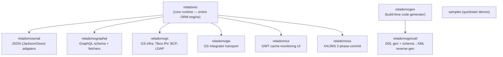

# The runtime is a multi-module build whose spine is `MithraManager` (global) and `MithraObjectPortal` (per-type)

> Part of [Research: Reladomo Core Features](00-index.md) — Reladomo @ commit
> `9b87d9e7cab32d4e9662b1d049a7d516e86f6bd4`. Repo root: the Reladomo checkout peer to this
> repository (`../reladomo`). Path abbreviations: **`mithra/`** =
> `reladomo/src/main/java/com/gs/fw/common/mithra/`; **`generator/`** =
> `reladomogen/src/main/java/com/gs/fw/common/mithra/generator/`.

Reladomo is an Ant-based multi-module build (`build/build.xml`, `build/reladomolib.spec`); there is
no parent Maven/Gradle POM. Only `reladomo` is the runtime library — every other module depends on it
(except the two build-time tools, which depend on nothing at runtime):



Module responsibilities (from each module's build files and READMEs): `reladomogen` is the Ant-task
code generator (214 source files, JavaCC query parser, JSP templates); `reladomogenutil` adds DDL
generation and schema-to-XML reverse engineering; `reladomoserial`/`reladomographql` are serialization
and GraphQL layers; `reladomogs`/`reladomogsi`/`reladomoui`/`reladomoxa` are GS-internal infra
adapters; `samples` are standalone demos depending on the published `reladomo` jar.

The core package `mithra/` splits into the subsystems below, all coordinated by the portal:

| Package | Responsibility |
|---|---|
| `finder/` | The `Operation` predicate tree, `RelatedFinder`, `SqlQuery`, `Mapper`, deep-fetch strategies |
| `attribute/` | Typed attributes (`IntegerAttribute`, `TimestampAttribute`, `AsOfAttribute`); build operations, map to columns |
| `cache/` | Per-type identity cache (object store); Full/Partial/Dated/OffHeap variants + index structures |
| `querycache/` | Per-type query-result cache (`QueryCache`, `CachedQuery`) |
| `transaction/` | `MithraRootTransaction`/`MithraNestedTransaction`, buffered write operations (`TxOperations`) |
| `database/` | JDBC execution layer (`MithraAbstractDatabaseObject` = reader + persister) |
| `databasetype/` | Per-vendor SQL dialects behind `DatabaseType` |
| `portal/` | The per-type coordinator (`MithraObjectPortal`, `MithraAbstractObjectPortal`, transactional/read-only) |
| `behavior/` | Object lifecycle state machine; `TemporalDirector` for milestoning |
| `list/` | `MithraList` implementations + bulk/cascade command objects |
| `aggregate/` | `AggregateList`, group-by/having operations |
| `notification/` | Cross-JVM cache invalidation messaging |
| `remote/` | Three-tier (client-server) alternate implementation |
| `connectionmanager/` | JDBC connection pools; sourceless/int-source/object-source variants |
| `mithraruntime/` | XML unmarshalling of the runtime config into a bean graph |

**`MithraManager` is the process-wide singleton coordinator** (`mithra/MithraManager.java`).
It owns the thread-local current transaction (`threadTransaction`, line 66), the transaction retry
loop (`executeTransactionalCommand`, line 524; `startOrContinueTransaction`, line 246), runtime config
loading (delegated to `MithraConfigurationManager`, `readConfiguration` line 740), the notification
event manager (line 601), and the global `databaseRetrieveCount` (line 69). `MithraManagerProvider`
(`mithra/MithraManagerProvider.java:31`) is a thin static accessor that lets tests substitute the
instance.

**`MithraObjectPortal` is the per-type "brain"** (`mithra/MithraObjectPortal.java`,
`mithra/portal/MithraAbstractObjectPortal.java`, subclasses `MithraTransactionalPortal` and
`MithraReadOnlyPortal`). Each domain type has exactly one portal holding its `cache`, `queryCache`,
`finder`, and `mithraObjectReader`/persister (fields at `MithraAbstractObjectPortal.java:115-152`).
The portal constructor creates the `QueryCache` inline and calls `cache.setMithraObjectPortal(this)`
to wire the back-reference (lines 156-170).

The central read dispatch — `findAsCachedQuery()` — shows the spine in action:

```text
SomeFinder.findMany(op)
  AbstractRelatedFinder.findMany(op)
    MithraAbstractObjectPortal.findAsCachedQuery(op)          [portal/MithraAbstractObjectPortal.java:832]
      1. QueryCache.findByEquality(op)                         → hit? return CachedQuery
      2. AnalyzedOperation(op)                                 normalize + inject as-of predicates
      3. op.applyOperationToFullCache()/applyOperationToPartialCache()  → identity cache probe
      4. [miss] flushTransaction(op)                           push pending writes for consistency
         findFromServer(op) → getMithraObjectReader().find()  [= *DatabaseObject.find()]
           new SqlQuery(op); getConnection(); executeQuery()
           processResultSet() → cache.getObjectFromData()      intern objects into identity cache
         MithraManager.incrementDatabaseRetrieveCount()
```

Startup wiring: `MithraManager.readConfiguration()` → `MithraConfigurationManager.initializeRuntime()`
instantiates each `<className>DatabaseObject` (implements both `MithraObjectReader` and
`MithraObjectPersister`), the `<className>Finder` (implements `RelatedFinder`), and calls the
generated `instantiateFullCache`/`instantiatePartialCache` which constructs the `Cache` and the
`MithraObjectPortal` (`mithra/util/MithraConfigurationManager.java:817, 1469-1500`).

## Testing patterns

Coordination/bootstrap is exercised through `MithraTestResource`
(`reladomo/src/test-util/java/com/gs/fw/common/mithra/test/MithraTestResource.java`), which parses a
runtime config, swaps in an in-process H2 connection manager via the
`MithraManager.zLazyInitObjectsWithCallback()` hook, and loads flat-file data. `MithraTestSuite`
(`reladomo/src/test/.../test/MithraTestSuite.java`) is the JUnit-3 aggregate run twice (partial vs
full cache). Remote-portal coordination is covered by `TestClientPortal`/`TestTransactionalClientPortal`.

## Code references

- `mithra/MithraManager.java` — global singleton: tx retry loop (524), `startOrContinueTransaction` (246), config (740), notification (601)
- `mithra/MithraManagerProvider.java` — static accessor (31)
- `mithra/MithraObjectPortal.java`, `mithra/portal/MithraAbstractObjectPortal.java` — per-type coordinator; `findAsCachedQuery` (832), `findFromServer` (1265), constructor wiring (156-170)
- `mithra/portal/MithraTransactionalPortal.java`, `MithraReadOnlyPortal.java` — subclasses
- `mithra/util/MithraConfigurationManager.java` — bootstrap; `initializeObject` (817), `LocalObjectConfig.initializeObject` (1469), programmatic `initializeRuntime` (284)
- `mithra/MithraRuntimeConfig.java` — init result DTO
