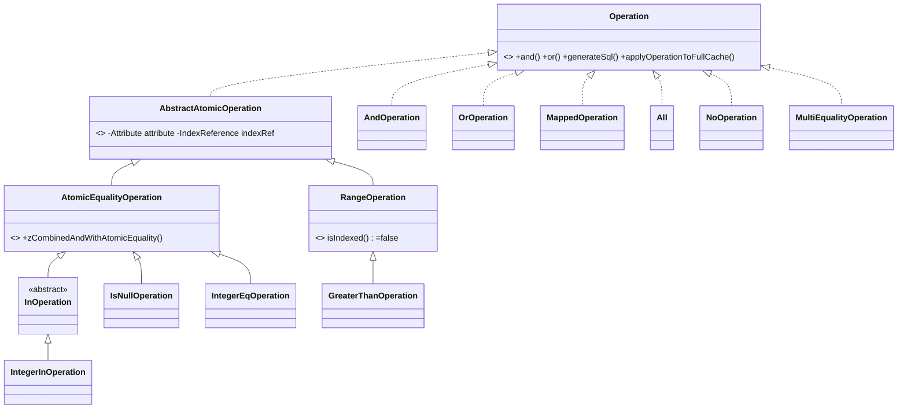

# The finder query language builds a composable `Operation` tree that `SqlQuery` compiles to a WHERE clause

> Part of [Research: Reladomo Core Features](00-index.md) — Reladomo @ commit
> `9b87d9e7cab32d4e9662b1d049a7d516e86f6bd4`. Repo root: the Reladomo checkout peer to this
> repository (`../reladomo`). Path abbreviations: **`mithra/`** =
> `reladomo/src/main/java/com/gs/fw/common/mithra/`; **`generator/`** =
> `reladomogen/src/main/java/com/gs/fw/common/mithra/generator/`.

Every query node implements `Operation` (`mithra/finder/Operation.java:33-152`), which carries three
cache-resolution modes (`applyOperationToFullCache`, `applyOperationToPartialCache`, `applyOperation`
over a list), the `and`/`or` algebra, `generateSql()`, and introspection (`usesUniqueIndex`,
`getResultObjectPortal`, `zIsNone`). Leaf predicates come from typed finder attributes:
`OrderFinder.orderId().eq(42)` constructs an `IntegerEqOperation` (`finder/integer/IntegerEqOperation.java`).

The taxonomy:



Combination uses **double-dispatch**: `.and()` on an `AtomicEqualityOperation` calls
`op.zCombinedAndWithAtomicEquality(this)` (`finder/AtomicEqualityOperation.java:105-113`); two
equalities on the same class collapse into a `MultiEqualityOperation` (a multi-column index lookup) —
otherwise an `AndOperation` is built. `AndOperation.combineOperands()`
(`finder/AndOperation.java:527-583`) repeatedly pairwise-combines operands, separates `MappedOperation`s,
applies equality substitution into sub-queries, and sorts by `OperationEfficiencyComparator`
(most-selective first). `NoOperation` is the `and`/`or` identity; `All` means "no WHERE clause"; `None`
short-circuits to empty.

SQL generation: `SqlQuery` (`finder/SqlQuery.java`) wraps the op in an `AnalyzedOperation` (which
lazily runs the `AsOfEqualityChecker`, see §6), pre-registers all portals/joins via
`MithraDatabaseIdentifierExtractor`, then `prepareQuery()` calls `op.generateSql(this)` (line 222) to
recursively emit fragments. The `WhereClause` (`finder/WhereClause.java`) is a `StringBuilder` with
deferred AND/OR/bracket tokens resolved lazily, and accumulates `SqlParameterSetter` callables that
later bind `?` placeholders.

```text
// op = AndOperation[ IntegerGreaterThanOperation(orderId,100),
//                    MappedOperation(EqualityMapper(Order.orderId↔OrderItem.orderId),
//                                    IntegerEqOperation(OrderItem.productId,99)) ]
SqlQuery(op) → AnalyzedOperation → idExtractor.registerOperations()
prepareQuery() → op.generateSql(q)
  AndOperation: for each operand → q.beginAnd(); operand.generateSql(q); q.endAnd()
    IntegerGreaterThanOperation → "t0.ORDER_ID > ?"
    MappedOperation → mapper.generateSql(q)  // emits JOIN on ORDER_ID, assigns alias t1
                      op.generateSql(q)       // "t1.PRODUCT_ID = ?"
```

A **`Mapper`** models one join step between two portals (`finder/Mapper.java`); `EqualityMapper`
(single column) and `MultiEqualityMapper` (composite key) emit `t0.LEFT = t1.RIGHT`; `LinkedMapper`
chains multi-hop relationships. `MapperStackImpl` tracks the active mapper chain so attributes resolve
to the correct table alias.

## Testing patterns

Query/operation behavior is covered by per-operator tests (`TestEq`, `TestIn`, `TestNotIn`, `TestLike`,
`TestGreaterThan`, …) and SQL-structure assertions via `Log4JRecordingAppender` (e.g. `TestExists.java:80-94`
counts `"left join"` occurrences in logged SQL). `MithraTestAbstract.genericRetrievalTest` cross-checks
ORM results against raw SQL row-by-row.

## Code references

- `Operation.java` (33-152), `AbstractAtomicOperation.java`, `AtomicEqualityOperation.java` (zCombinedAndWithAtomicEquality 105), `AndOperation.java` (combineOperands 527), `OrOperation.java`, `MappedOperation.java` (generateSql 537, applyOperation 157)
- `finder/integer/IntegerEqOperation.java`, `IntegerInOperation.java`; `IsNullOperation.java`, `RangeOperation.java`, `All.java`, `NoOperation.java`, `MultiEqualityOperation.java`
- `AnalyzedOperation.java`, `SqlQuery.java` (prepareQuery 194), `WhereClause.java`
- `Mapper.java`, `EqualityMapper.java`, `MultiEqualityMapper.java`, `LinkedMapper.java`, `MapperStackImpl.java`
