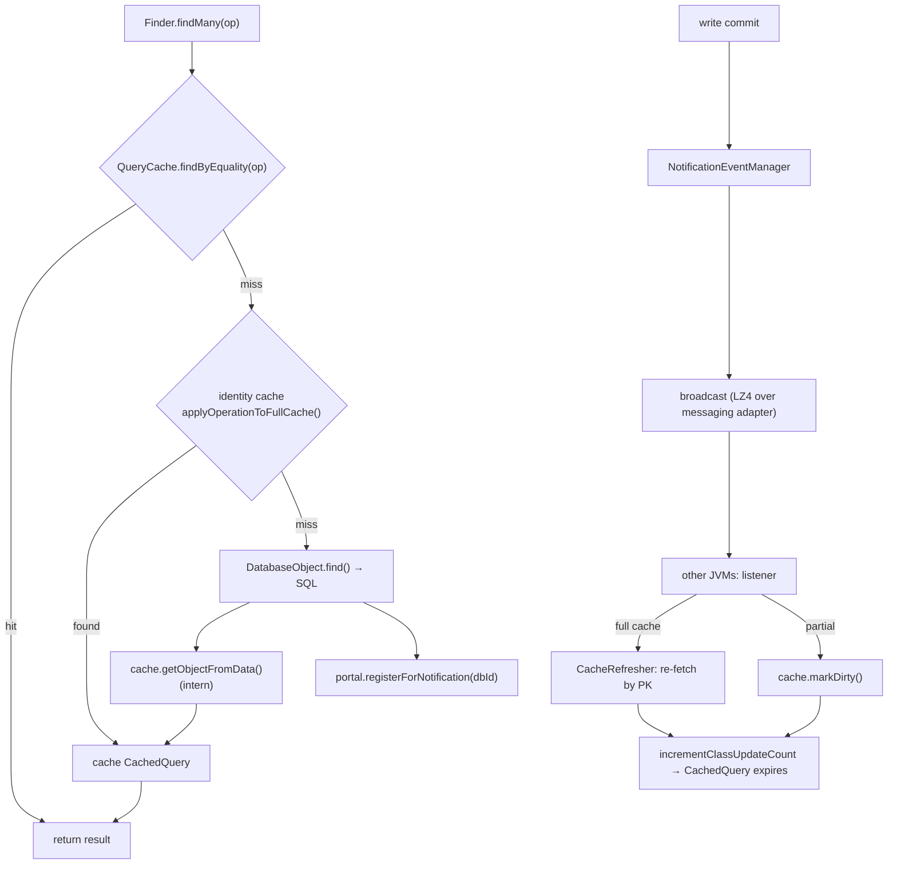

# The identity cache guarantees one object per PK; the query cache maps operations to results; notification invalidates both

> Part of [Research: Reladomo Core Features](00-index.md) — Reladomo @ commit
> `9b87d9e7cab32d4e9662b1d049a7d516e86f6bd4`. Repo root: the Reladomo checkout peer to this
> repository (`../reladomo`). Path abbreviations: **`mithra/`** =
> `reladomo/src/main/java/com/gs/fw/common/mithra/`; **`generator/`** =
> `reladomogen/src/main/java/com/gs/fw/common/mithra/generator/`.

Each type has two caches behind the portal. The **identity cache** (`mithra/cache/Cache.java`) interns
objects so there is exactly one in-memory instance per primary key: database rows are funneled through
`getObjectFromData()`/`getManyObjectsFromData()` (`mithra/cache/AbstractNonDatedCache.java:1023-1155`),
which look up the primary-key index under a read lock and create via `factory.createObject(data)` only
on miss (double-checked under write lock). The implementation matrix:

| Cache | Dated | Full/Partial | Heap | Primary index | Eviction |
|---|---|---|---|---|---|
| `FullNonDatedCache` | no | full | on | `FullUniqueIndex` (strong) | none |
| `PartialNonDatedCache` | no | partial | on | `PartialPrimaryKeyIndex` (soft/weak) | GC + TTL |
| `FullDatedCache` | yes | full | on | `FullSemiUniqueDatedIndex` | none |
| `PartialDatedCache` | yes | partial | on | `PartialSemiUniqueDatedIndex` | GC + TTL |
| `OffHeapFullDatedCache` | yes | full | off | `OffHeapSemiUniqueDatedIndex` | manual off-heap |

The dated caches use a **semi-unique** index (`SemiUniqueDatedIndex`): the non-dated business key is
non-unique (many effective dates), but the full key (business key + as-of dates) is unique;
`FullSemiUniqueDatedIndex` keeps two hash tables (non-dated + dated). Secondary non-unique indices are
wrapped in `LazyIndex` (populated on first use). Partial caches use soft/weak references with a
background `MithraReferenceThread` and a `CacheClock` TTL.

The **query cache** (`mithra/querycache/QueryCache.java`) maps an `Operation` to a `CachedQuery`
holding the live result list of already-interned objects. Freshness is via `UpdateCountHolder` version
tokens: a `CachedQuery` records the update-counts of all portals/attributes it depends on, and
`isExpired()` (`mithra/querycache/CachedQuery.java:259-266`) returns true if any changed — so any write
that bumps a class/attribute update-count invalidates all dependent cached queries without enumerating
them. Full caches use a lock-free `NonLruQueryIndex`; partial/timed caches use an LRU `LruQueryIndex`.

The full read flow and invalidation bus:

Notification (`mithra/notification/`): on commit, `MithraLocalTransaction` broadcasts buffered
`MithraNotificationEvent`s (serialized + LZ4) on a per-database subject; receiving JVMs dispatch to a
`MithraNotificationListener`. Full-cache listeners re-fetch changed rows from the DB
(`CacheRefresher`); partial-cache listeners just `markDirty` and bump update counts.

## Testing patterns

`TestCache.java` (full/partial × dated/non-dated, TTL via `CacheClock.forceTick()`), `TestPartialCache.java`
(direct `LruQueryIndex`/`PartialPrimaryKeyIndex`/`ReadWriteLock` unit tests),
`notification/InMemoryMessagingAdapterFactory` (in-process notification), and
`multivm/MultiVmNotificationsTestSuite` (forked-JVM notification).

## Code references

- `mithra/cache/Cache.java` (interface), `AbstractNonDatedCache.java` (getObjectFromData 1023), `AbstractDatedCache.java`, `FullNonDatedCache.java`, `PartialNonDatedCache.java`, `FullDatedCache.java`, `PartialDatedCache.java`
- Indices: `FullUniqueIndex.java`, `PartialPrimaryKeyIndex.java`, `NonUniqueIdentityIndex.java`, `SemiUniqueDatedIndex.java`, `FullSemiUniqueDatedIndex.java`, `LazyIndex.java`; `CacheClock.java`, `MithraReferenceThread.java`, `CacheRefresher.java`
- `mithra/cache/offheap/` — `OffHeapFullDatedCache.java`, `OffHeapDataStorage.java`, `FastUnsafeOffHeapDataStorage.java`, `MithraOffHeapDataObject.java`, `OffHeapSyncableCache.java`
- `mithra/querycache/QueryCache.java`, `CachedQuery.java` (isExpired 259); `mithra/cache/LruQueryIndex.java`, `NonLruQueryIndex.java`
- `mithra/notification/` — `MithraNotificationEventManagerImpl.java`, `MithraNotificationEvent.java`, `listener/{Full,Partial}CacheMithraNotificationListener.java`
