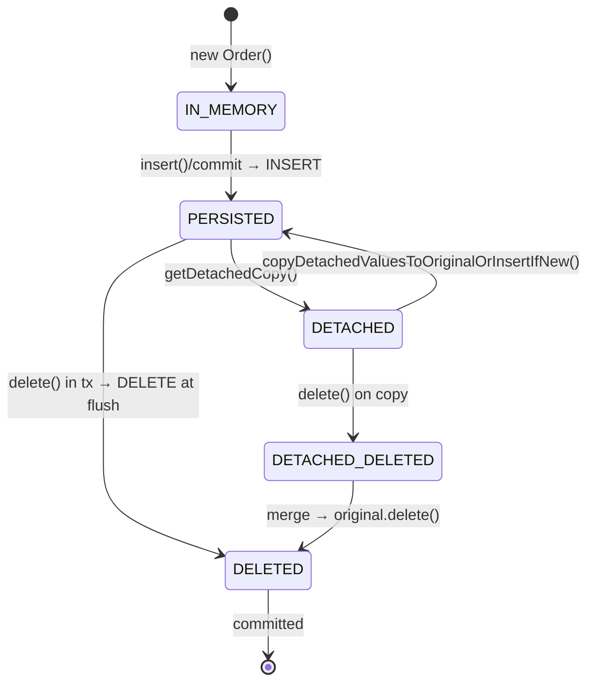

# Object lifecycle is a state machine dispatched through per-state singleton behavior objects; detach copies data and merges it back

> Part of [Research: Reladomo Core Features](00-index.md) — Reladomo @ commit
> `9b87d9e7cab32d4e9662b1d049a7d516e86f6bd4`. Repo root: the Reladomo checkout peer to this
> repository (`../reladomo`). Path abbreviations: **`mithra/`** =
> `reladomo/src/main/java/com/gs/fw/common/mithra/`; **`generator/`** =
> `reladomogen/src/main/java/com/gs/fw/common/mithra/generator/`.

Each transactional object holds a `persistenceState` int and a nullable `TransactionalState`. The
states (`mithra/behavior/state/PersistenceState.java:40-47`): `IN_MEMORY` (new, uninserted),
`PERSISTED`, `DELETED`, `DETACHED`, `DETACHED_DELETED`, plus non-transactional variants. A static
`allStates[]` table maps each state to a `PersistenceState` object that returns one of five singleton
`TransactionalBehavior` instances depending on the relationship between the calling thread's
transaction and the object's enrolled transaction (`getForNoTransaction`, `getForSameTransaction`,
`getForEnrollTransaction`, `getForDifferentTransaction`, `getForThreadNoObjectYesTransaction`). Every
get/set/insert/delete dispatches through
`zGetTransactionalBehaviorFor{Read,Write}WithWaitIfNecessary()`, which routes via the current
`MithraManager.zGetTransactionalBehaviorChooser()`.

**Detaching** (`PersistedBehavior.getDetachedCopy`, `mithra/behavior/persisted/PersistedBehavior.java:73-82`)
deep-copies the data object into a brand-new instance with `persistenceState=DETACHED` and a null
`transactionalState` — fully decoupled from the cache (the original keeps living in the cache). Modifying
a detached object writes only to its in-memory copy (no SQL). **Merging back**
(`copyDetachedValuesToOriginalOrInsertIfNew`, `mithra/superclassimpl/MithraTransactionalObjectImpl.java:1563-1589`)
starts a transaction, calls `zFindOriginal()` (cache lookup by PK), and if found copies attributes onto
the live object (triggering normal buffered UPDATEs) or inserts if new. `isModifiedSinceDetachment()`
compares the copy to the original field-by-field.

## Testing patterns

`TestDetached.java` (detached insert/update), `TestDatedDetached.java`, `TestTransactionalObject.java`
(multi-thread detached/delete interactions). Behavior-state dispatch is exercised implicitly by the
whole transactional test corpus.

## Code references

- `mithra/superclassimpl/MithraTransactionalObjectImpl.java` — getDetachedCopy (115), copyDetachedValuesToOriginalOrInsertIfNew (1563)
