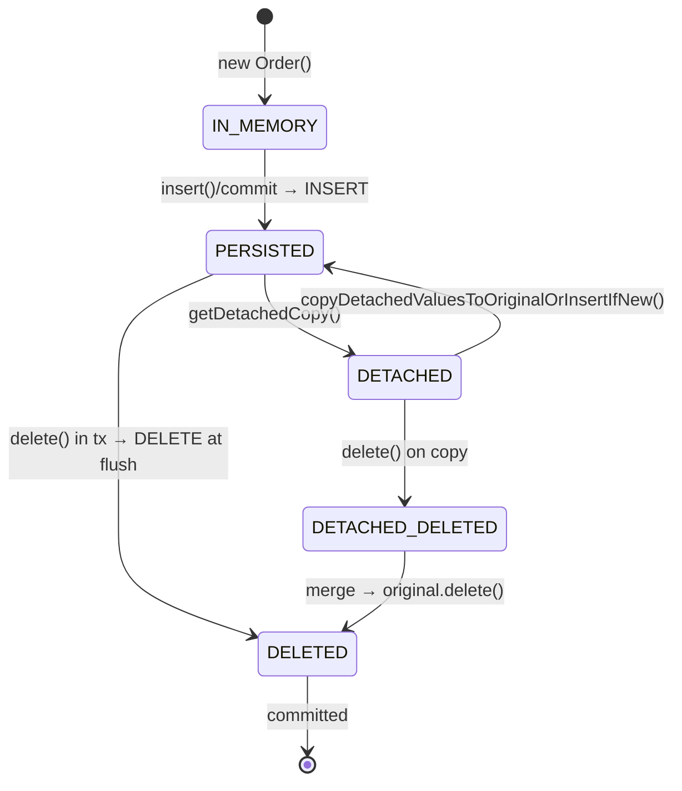

# Object lifecycle is a state machine dispatched through per-state singleton behavior objects; detach copies data and merges it back

> Part of [Research: Reladomo Core Features](00-index.md) — Reladomo @ commit
> `9b87d9e7cab32d4e9662b1d049a7d516e86f6bd4`. Repo root: the Reladomo checkout peer to this
> repository (`../reladomo`). Path abbreviations: **`mithra/`** =
> `reladomo/src/main/java/com/gs/fw/common/mithra/`; **`generator/`** =
> `reladomogen/src/main/java/com/gs/fw/common/mithra/generator/`.

Each transactional object holds a `persistenceState` int and a nullable `TransactionalState`. The
states (`mithra/behavior/state/PersistenceState.java:40-47`): `IN_MEMORY` (new, uninserted),
`PERSISTED`, `DELETED`, `DETACHED`, `DETACHED_DELETED`, plus non-transactional variants. A static
`allStates[]` table maps each state to a `PersistenceState` object that returns one of five singleton
`TransactionalBehavior` instances depending on the relationship between the calling thread's
transaction and the object's enrolled transaction (`getForNoTransaction`, `getForSameTransaction`,
`getForEnrollTransaction`, `getForDifferentTransaction`, `getForThreadNoObjectYesTransaction`). Every
get/set/insert/delete dispatches through
`zGetTransactionalBehaviorFor{Read,Write}WithWaitIfNecessary()`, which routes via the current
`MithraManager.zGetTransactionalBehaviorChooser()`.

```mermaid
stateDiagram-v2
    [*] --> IN_MEMORY : new Order()
    IN_MEMORY --> PERSISTED : insert()/commit → INSERT
    PERSISTED --> DELETED : delete() in tx → DELETE at flush
    PERSISTED --> DETACHED : getDetachedCopy()
    DETACHED --> DETACHED_DELETED : delete() on copy
    DETACHED --> PERSISTED : copyDetachedValuesToOriginalOrInsertIfNew()
    DETACHED_DELETED --> DELETED : merge → original.delete()
    DELETED --> [*] : committed
```

**Detaching** (`PersistedBehavior.getDetachedCopy`, `mithra/behavior/persisted/PersistedBehavior.java:73-82`)
deep-copies the data object into a brand-new instance with `persistenceState=DETACHED` and a null
`transactionalState` — fully decoupled from the cache (the original keeps living in the cache). Modifying
a detached object writes only to its in-memory copy (no SQL). **Merging back**
(`copyDetachedValuesToOriginalOrInsertIfNew`, `mithra/superclassimpl/MithraTransactionalObjectImpl.java:1563-1589`)
starts a transaction, calls `zFindOriginal()` (Finder lookup by PK, served from cache or database), and if found copies attributes onto
the live object (triggering normal buffered UPDATEs) or inserts if new. `isModifiedSinceDetachment()`
compares the copy to the original field-by-field.

## Detached merge version checks and retries

A detached merge has two distinct optimistic checks: an in-memory comparison with the detached
copy's version, and a SQL gate against the persisted predecessor used by the current attempt.
Enabling optimistic retries changes the first check; it does not remove the second.

For processing-dated objects, including bitemporal objects, the handoff is:

1. `DatedDetachedSameTxBehavior.updateOriginalOrInsert` calls the detached object's
   `zFindOriginal()`, then passes the detached data to **the live original's**
   `zCopyAttributesFrom`. The generated lookup uses `Finder.findOne`, so finding the original
   does not guarantee a new database query or fresh data
   ([detached handoff](https://github.com/goldmansachs/reladomo/blob/9b87d9e7cab32d4e9662b1d049a7d516e86f6bd4/reladomo/src/main/java/com/gs/fw/common/mithra/behavior/detached/DatedDetachedSameTxBehavior.java#L187-L197),
   [generated lookup](https://github.com/goldmansachs/reladomo/blob/9b87d9e7cab32d4e9662b1d049a7d516e86f6bd4/reladomogen/src/main/templates/datedtransactional/Abstract.jsp#L448-L453)).
2. The live original's `zCopyAttributesFromImpl` obtains its own current data and compares it
   with the supplied detached data. The generated `zCheckOptimisticLocking` rejects unequal
   processing-from values only when participation is optimistic **and**
   `retryOnOptimisticLockFailure()` is false. With that retry flag true, this comparison is
   skipped even on the first attempt
   ([runtime call](https://github.com/goldmansachs/reladomo/blob/9b87d9e7cab32d4e9662b1d049a7d516e86f6bd4/reladomo/src/main/java/com/gs/fw/common/mithra/superclassimpl/MithraDatedTransactionalObjectImpl.java#L1527-L1536),
   [generated check](https://github.com/goldmansachs/reladomo/blob/9b87d9e7cab32d4e9662b1d049a7d516e86f6bd4/reladomogen/src/main/templates/datedtransactional/Abstract.jsp#L1871-L1882)).
3. Generated `issueUpdates` compares ordinary attribute values and invokes the normal update
   machinery for differences. It excludes as-of start/end attributes, so the detached copy's
   processing-from timestamp is not copied onto the live original. This is not a three-way
   merge that distinguishes user edits from other differences between the two objects
   ([attribute copying](https://github.com/goldmansachs/reladomo/blob/9b87d9e7cab32d4e9662b1d049a7d516e86f6bd4/reladomogen/src/main/templates/datedtransactional/Abstract.jsp#L1884-L1898)).
4. The temporal director closes live predecessor objects and inserts successors with the
   transaction's processing time. Dated UPDATEs obtain the predecessor's `zGetCurrentData()`;
   generated SQL parameter binding reads processing-from from that data for the optimistic
   gate. Neither the detached timestamp nor the newly inserted successor timestamp supplies
   that gate
   ([predecessor closure](https://github.com/goldmansachs/reladomo/blob/9b87d9e7cab32d4e9662b1d049a7d516e86f6bd4/reladomo/src/main/java/com/gs/fw/common/mithra/behavior/GenericBiTemporalDirector.java#L301-L342),
   [successor insertion](https://github.com/goldmansachs/reladomo/blob/9b87d9e7cab32d4e9662b1d049a7d516e86f6bd4/reladomo/src/main/java/com/gs/fw/common/mithra/behavior/GenericBiTemporalDirector.java#L390-L403),
   [UPDATE data source](https://github.com/goldmansachs/reladomo/blob/9b87d9e7cab32d4e9662b1d049a7d516e86f6bd4/reladomo/src/main/java/com/gs/fw/common/mithra/database/MithraAbstractDatedTransactionalDatabaseObject.java#L219-L230),
   [committed predecessor data](https://github.com/goldmansachs/reladomo/blob/9b87d9e7cab32d4e9662b1d049a7d516e86f6bd4/reladomo/src/main/java/com/gs/fw/common/mithra/transaction/InTransactionDatedTransactionalObject.java#L100-L103),
   [gate binding](https://github.com/goldmansachs/reladomo/blob/9b87d9e7cab32d4e9662b1d049a7d516e86f6bd4/reladomogen/src/main/templates/CommonDatabaseObjectAbstract.jspi#L201-L215)).

For a single affected predecessor, suppose the detached copy carries processing-from `P1`,
but another transaction has already replaced the database row with a current row at `P2`:

| Live original used by this attempt | Optimistic retry disabled | Optimistic retry enabled |
|---|---|---|
| Fresh original at `P2` | Detached `P1` versus original `P2` fails before SQL | Comparison skipped; SQL gates on `P2`, and can succeed if the database still has `P2` |
| Stale cached original at `P1` | In-memory comparison passes; SQL gate on `P1` fails against database `P2` | Same SQL failure; invalidation and a retry can resolve an original at `P2`, then proceed as above |

A successful write inserts its successor at `P3`. A further concurrent change after this attempt
resolved `P2` still makes the `P2` SQL gate fail. Thus SQL protects the attempt's observed
predecessor, while retry-enabled detached merge does **not** preserve `P1` as an immutable caller
precondition. Here, “rebasing” means reapplying detached values to a newly resolved live original;
it does not mean updating the detached copy's token or using `P1` successfully against `P2`.
SQL failure marks predecessor data dirty for reload
([affected-row check](https://github.com/goldmansachs/reladomo/blob/9b87d9e7cab32d4e9662b1d049a7d516e86f6bd4/reladomo/src/main/java/com/gs/fw/common/mithra/database/MithraAbstractDatabaseObject.java#L3725-L3746));
retry eligibility is described in
[29](29-blind-write-prevention-for-deletes-and-terminates.md#related-observations).
For writes spanning several business intervals, predecessor resolution and per-row gates are
described in [06](06-bitemporal-milestoning.md#writes-resolve-complete-affected-business-ranges)
and [09](09-transactions-locking.md#bitemporal-concurrency-scope).

Non-dated versioned objects have the analogous retry-dependent in-memory comparison in
`MithraTransactionalObjectImpl.zCopyAttributesFromImpl`
([source](https://github.com/goldmansachs/reladomo/blob/9b87d9e7cab32d4e9662b1d049a7d516e86f6bd4/reladomo/src/main/java/com/gs/fw/common/mithra/superclassimpl/MithraTransactionalObjectImpl.java#L1411-L1427)).
These findings concern the standard detached-object merge path, not a standalone scalar-token
replacement interface.

## Testing patterns

`TestDetached.java` (detached insert/update), `TestDatedDetached.java`, `TestTransactionalObject.java`
(multi-thread detached/delete interactions). Behavior-state dispatch is exercised implicitly by the
whole transactional test corpus.

`TestOptimisticTransactionParticipation.testDatedOptimisitcLockExceptionWithDetached`
(`:1711-1744`, spelling as declared) creates two detached copies, merges one, and asserts that
merging the stale second copy under optimistic participation raises an exception with the
default retry flag. `testDatedOptimisticLockFailure` (`:113-175`) exercises
stale cached processing-dated state, raw-JDBC replacement, and retry-enabled refresh: its second
attempt sees the new value and reapplies the setter. It supports the refresh behavior above,
but is not a detached-merge test. The detached-check bypass and SQL-token handoff were traced
in source; no retry-enabled detached merge test was identified in this pass. Test definitions were inspected,
not executed.

## Code references

- `mithra/superclassimpl/MithraTransactionalObjectImpl.java` — getDetachedCopy (115), copyDetachedValuesToOriginalOrInsertIfNew (1563)
